# STONKS #

## 1. Description ##
* **Given:** a logical image `evidence.ad1` which was collected by `FTK Imager`. 
* **Description:** A major real estate and development corporation is under investigation for large-scale financial fraud. The company allegedly inflated revenues and concealed massive debt in order to secure bank loans and push through a stock exchange listing. Public reports painted a picture of strong growth, but the truth tells otherwise. Law enforcement has seized a corporate server believed to store critical documents. However, investigators suspect that the original financial statements reflecting the company’s real losses were deleted in an attempt to cover up the fraud. As a digital forensics specialist, your mission is to recover the missing file and bring the hidden truth to light.
* **Hints:**
    * No hint was given.
* **Difficulty:** Insane 

## 2. Investigation ##

### A Quick Glance ###

The file size was `174,250KB`. I opened the file using `FTK Imager`:

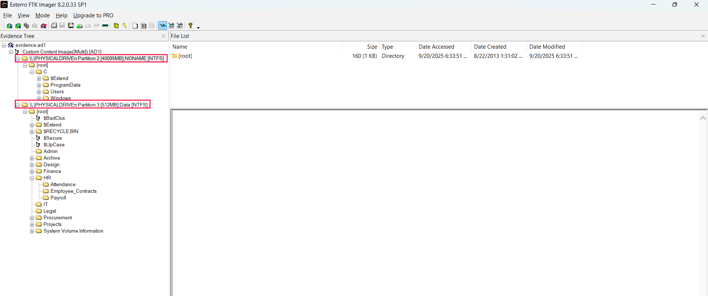

The image revealed two NTFS partitions:
* Partition 2 [40095MB]: NONAME [NTFS] (contains the root directories of the Windows `C:\` drive).
* Partition 3 [512MB]: Data [NTFS] (contains departmental data such as HR, IT, Finance, etc., along with a specific directory named `System Volume Information`).

I initially analyzed Partition 3. Inside almost every directory, most entries — except for $I30 — appeared in pairs: the original file and a corresponding `.FileSlack` entry:

> **File Slack:** The unused bytes between the logical EOF and the end of its last allocated cluster. These bytes are not part of the file's logical content, but may still contain residual data from previous filesystem activity. Read more about it here [File Slack](https://www.networkintelligence.ai/blogs/file-slack-vs-ram-slack-vs-drive-slack/).

But that's not the point. The interesting thing is that, for all of the normal files, the `File Type` column is `Reparse Point`, and the file content is no longer stored in the original file streams:

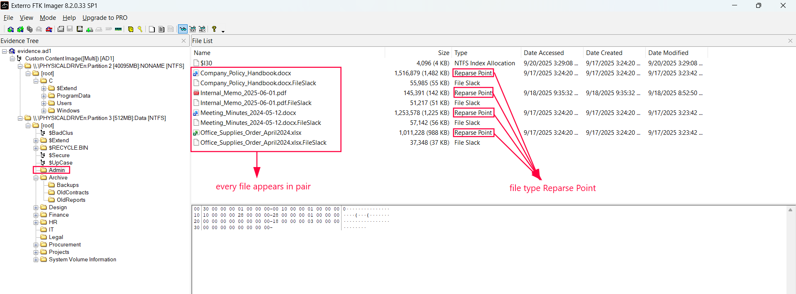

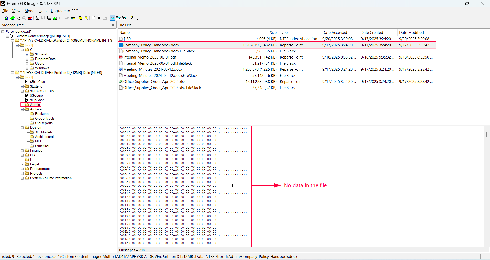

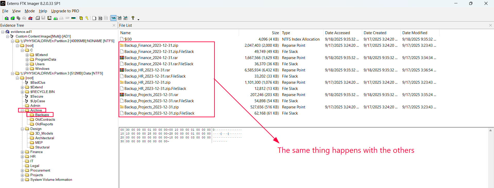

Combining this information with the `System Volume Information` directory we found in the first place, we can conclude that the `Windows Server Data Deduplication` feature is enabled on this machine.

### NTFS Data Deduplication ###

**NTFS Data Deduplication:** Windows Server Data Deduplication reduces storage usage by splitting files into variable chunks, storing unique chunks in the `ChunkStore` under `System Volume Information`, and replacing optimized files with the reparse point tag containing metadata that allows Windows to map the logical file back to the chunks required to reconstruct it:

```text
├── System Volume Information
    ├── Dedup
        ├── State            (dedup runtime/state metadata)
        ├── Settings         (dedup configuration and policy)
        ├── Logs             (logs and recovery metadata)
        └── ChunkStore       (metadata and physical data for optimized files)
            ├── {GUID}.ddp 
                ├── Stream   (stream map: map logical file streams to their chunks)
                ├── Hotspot  (copies of highly referenced chunks for resiliency)
                └── Data     (chunk containers holding the actual deduplicated data)
```

Although the mechanism is the same, the structures used to store chunks have changed across different Windows Server versions since their first appearance in `Windows Server 2012 R2 / 2012`. So first we need to identify this server version. We can find this information in the registry hive `SOFTWARE`.

`HKLM\SOFTWARE\Microsoft\Windows NT\CurrentVersion`:

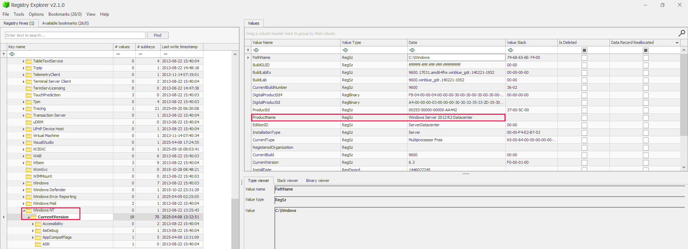

The key `ProductName` is `Windows Server 2012 R2 Datacenter`. You can read more about it in [Microsoft — Data Deduplication Overview (Windows Server 2012 R2 and 2012)](https://learn.microsoft.com/en-us/previous-versions/windows/it-pro/windows-server-2012-r2-and-2012/hh831602(v=ws.11)). So those are a few initial investigation steps; now let's move to the questions.

### Tasks ###

#### Data Deduplication Configuration ####

##### Task 1 #####

```text
When was the Windows Data Deduplication feature first installed on the system?
```

There are several ways to install this feature: through `PowerShell` or the `Server Manager` GUI.

At first, I checked `Windows PowerShell.evtx` and `Microsoft-Windows-PowerShell/Operational.evtx`, but neither of them had the required information. So the next log I used was `System.evtx`:

> **System:** The `System.evtx` log records operating system and service-related activity. Event `7045` from `Service Control Manager` contains information about the installation of new services on the system.

By filtering for event `7045` or searching for `Data Deduplication`, we can identify the timestamp of the first event recorded when this feature was installed on the server:

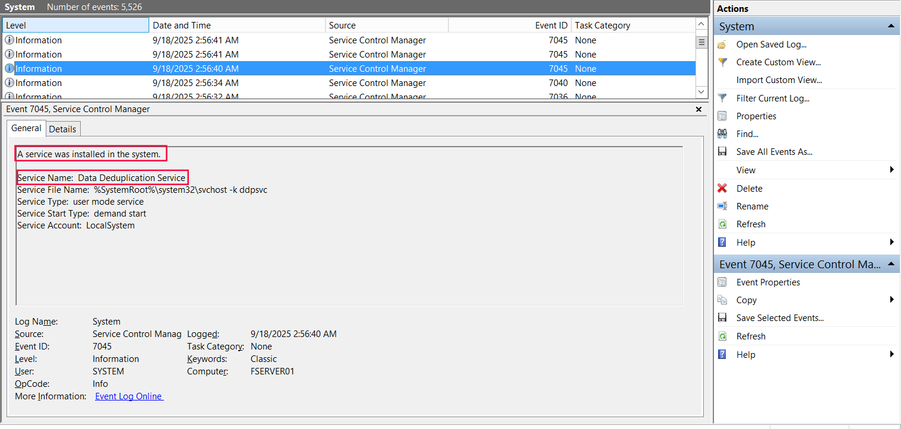

However, the challenge requires the answer in UTC. This can be obtained from the event's XML view:

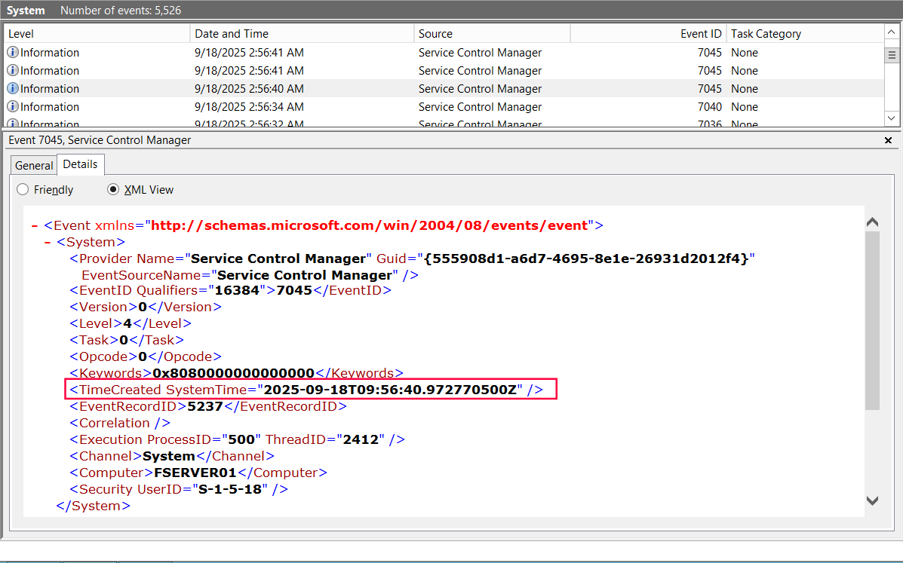

So the answer is: `2025-09-18 09:56:40`.

##### Task 2 & Task 5 #####

```text
How many bytes of disk space were saved after the first optimization job was completed by Data Deduplication?

How many files have been optimized by Data Deduplication?
```

From this article, [Running Data Deduplication](https://learn.microsoft.com/en-us/windows-server/storage/data-deduplication/run), I learnt that information about Data Deduplication jobs is recorded in the `Microsoft-Windows-Deduplication/Operational` log. But if you open this log on a machine that does not have the Data Deduplication feature installed, Event Viewer will not be able to render the event text:

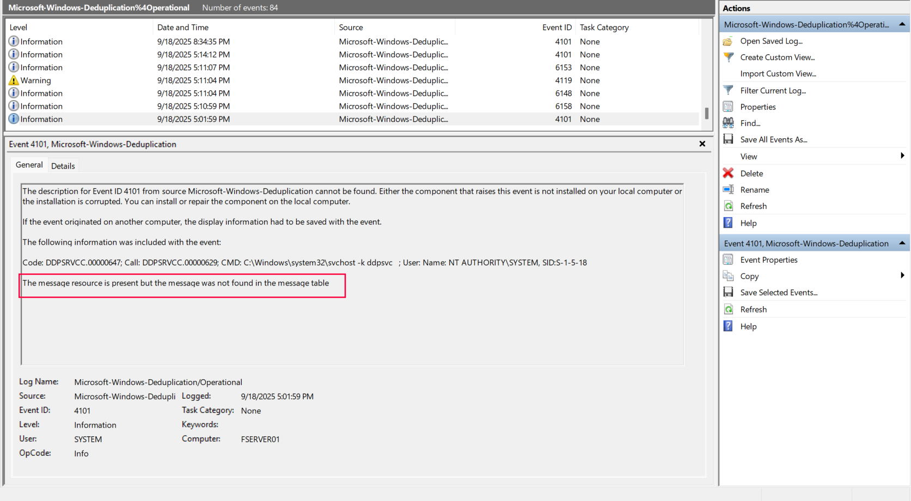

So I set up a `Windows Server 2012 R2` VM. You can download the ISO file from Microsoft [here](https://www.microsoft.com/en-us/evalcenter/download-windows-server-2012-r2). After several setup stages, I opened `Microsoft-Windows-Deduplication/Operational.evtx` in Event Viewer:

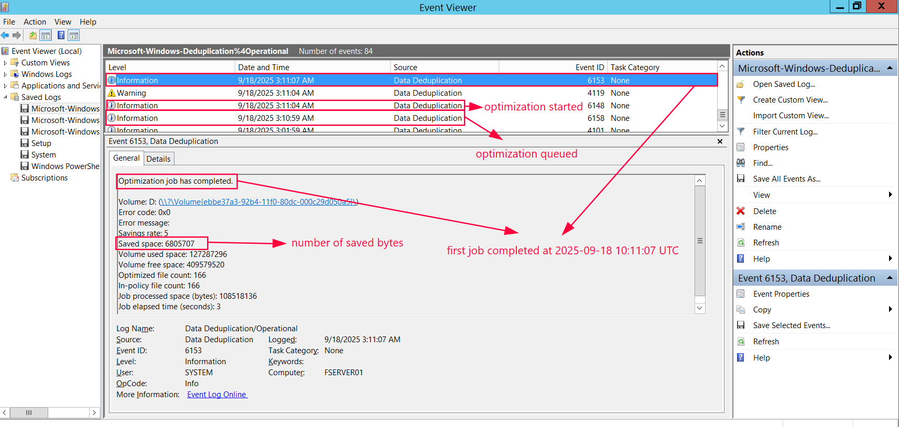

The picture shows the earliest event ID `6153`—Optimization job completed—at `2025-09-18 10:11:07 UTC`. The job's elapsed time was 3 seconds, which checks out because the earlier event ID `6148`—Optimization job started—was recorded at `2025-09-18 10:11:04 UTC`, and `Saved space` was `6805707` bytes.

###### Task 5 ######

Using the same log, I checked the most recent completed job. At that point, the total number of optimized files was `168`. A side note is that `Optimized files count` is cumulative; it doesn't show the number of files optimized by that individual job but the total number of optimized files reported at that point:

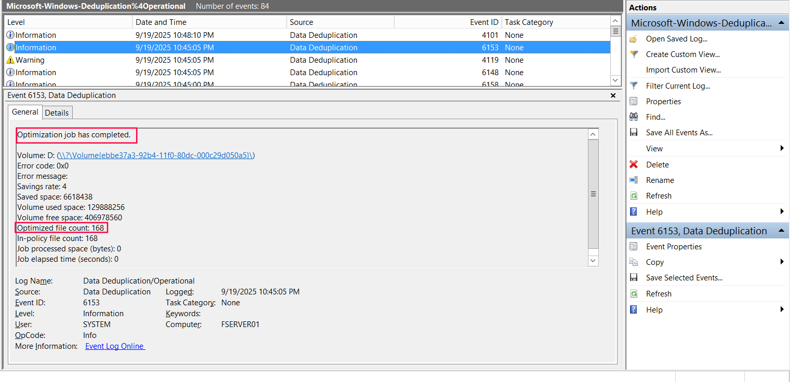

So the answer to Task 2 is `6805707`, and the answer to Task 5 is `168`.

##### Task 3 #####

```text
When was Data Deduplication most recently re-enabled on volume D:?
```

At first, I thought the answer was the timestamp of the latest job's start event, so I continued using the log from the previous question, which gave `2025-09-20 05:45:05`, but it was not the answer.

So I did some research on the Internet and found this article: [Backup and Restore of Data Deduplication-Enabled Volumes](https://learn.microsoft.com/en-us/previous-versions/windows/desktop/dedup/backup-and-restore-of-data-deduplication-enabled-volumes). Microsoft states that the Data Deduplication configuration for a volume is stored under `\System Volume Information\Dedup\Settings\*`:

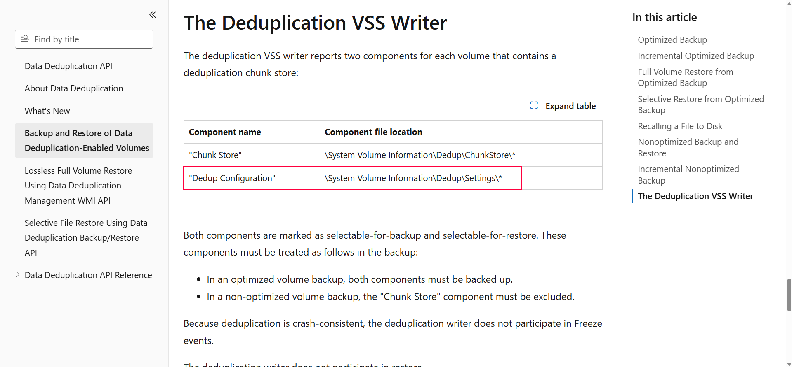

Inside this directory, I found `dedupConfig.01.xml` and `dedupConfig.02.xml`. Both files contain the same `changeTime` value:

```xml
<property name="changeTime" type="VT_UI8" value="134028128759740533" />
```

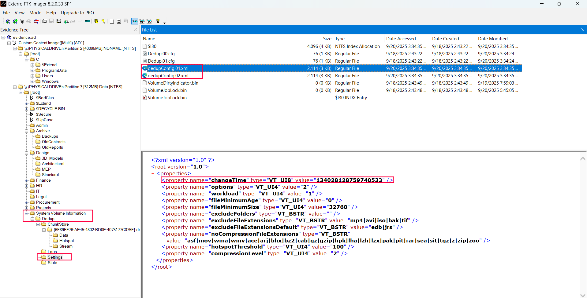

This number represents the most recent change to the dedup configuration on the volume, corresponding to the latest re-enable operation. The value is stored as a Windows FILETIME. Using CyberChef to convert it, I got `Sat 20 September 2025 03:34:35 UTC`, which is `2025-09-20 03:34:35` in the answer format:

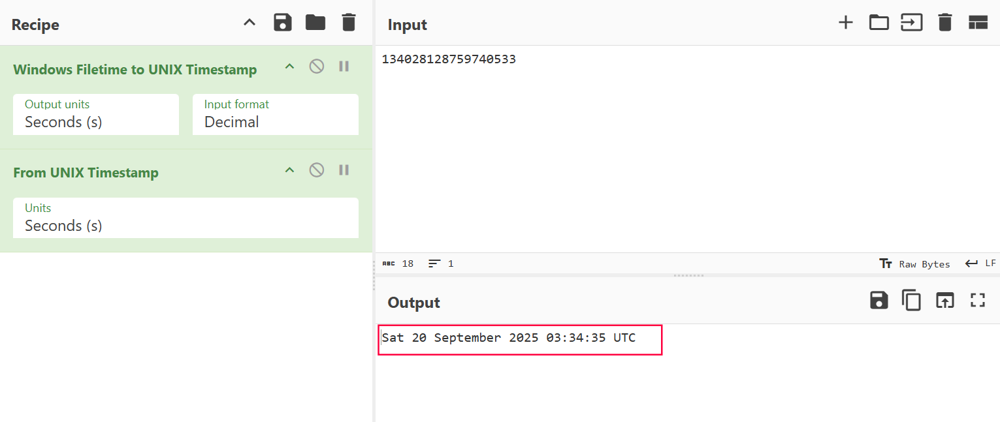

So the answer is: `2025-09-20 03:34:35`.

##### Task 4 #####

```text
List all file extensions that are not optimized by Data Deduplication in alphabetical order.
```

I continued examining `dedupConfig.01.xml` and found two properties that caught my attention:

```xml
<property name="excludeFileExtensions" type="VT_BSTR" value="mp4|avi|iso|bak|tif" /> 
<property name="excludeFileExtensionsDefault" type="VT_BSTR" value="edb|jrs" />
```

In total, 7 file extensions are excluded from being optimized by dedup. After sorting them in alphabetical order, I got the answer (remember to include a space after each comma lol).

So the answer is: `avi, bak, edb, iso, jrs, mp4, tif`.

##### Task 6 #####

```text
When is the next Throughput Optimisation job scheduled to run?
```

> **Scheduled Tasks:** Task definitions are stored as XML files under `C:\Windows\System32\Tasks`. Their trigger, schedule, command, and enabled state can be examined directly from these files.

Data deduplication jobs are implemented through scheduled tasks under `Windows\System32\Tasks\Microsoft\Windows\Deduplication`. According to [this article](https://learn.microsoft.com/en-us/previous-versions/windows/it-pro/windows-server-2012-r2-and-2012/hh831434%28v%3Dws.11%29) from Microsoft, three schedules are configured by default: `Background Optimization`, `Weekly Garbage Collection`, and `Weekly Scrubbing`, while up to 2 additional `Throughput Optimization` schedules can also be configured:

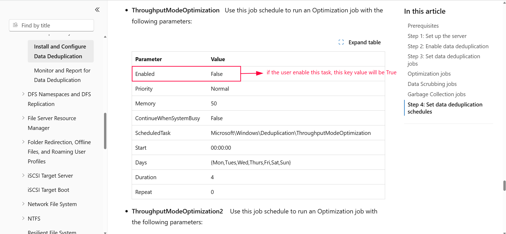

That's why I checked `Windows\System32\Tasks\Microsoft\Windows\Deduplication\ThroughputOptimization`:

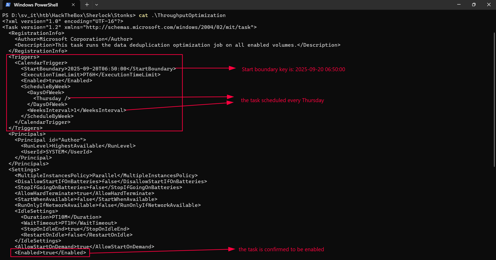

As you can see, the file content shows an enabled weekly trigger scheduled for every Thursday at `06:50:00`. Since the trigger became active on `2025-09-20`, which was a Saturday (given by CyberChef in Task 3), the next Thursday would be `2025-09-25`.

So the answer is: `2025-09-25 06:50:00`.

#### Master File Table ####

##### Task 7 #####

```text
What is the name of the financial report that was recently deleted in an attempt to cover up criminal activity?
```

I solved the following three tasks using only the `$MFT` file.

>  **Master File Table (MFT):** The `$MFT` is the core metadata file of an NTFS volume. Each file and directory is represented by an MFT record containing attributes such as filenames, timestamps, data information, and allocation status. Even after a file is deleted, its MFT record may remain until it is reused, which allows tools to recover information about the deleted file.

Since the Task 7 description mentions a financial report, obviously I checked the `Finance` directory. Inside, there's a folder named `Reports` that contains all documents from `Q1`, `Q2`, `Q3`, `Q4`, and `Annual`, but only one deleted file: `Finance\Reports\Annual\Internal Consolidated Financial Statements 2024.docx`:

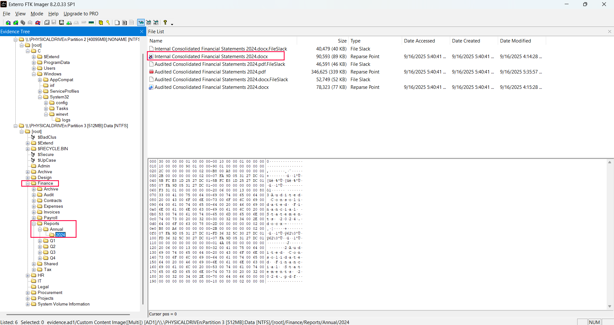

To check if the file is really deleted, I used a tool named `MFTExplorer` developed by Eric Zimmerman:

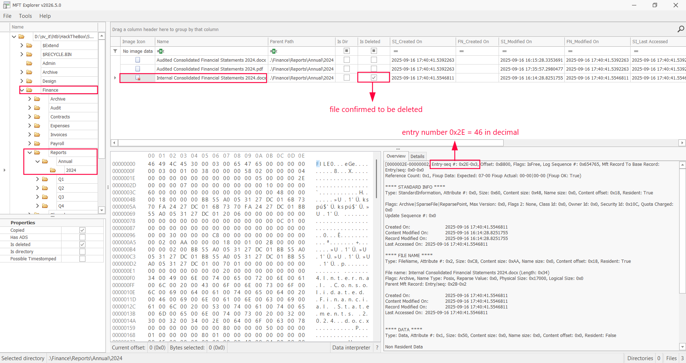

At this point, we have no way to examine the file content and confirm whether its deletion was really an attempt to cover up criminal activity as described, but it's our only financial report that has been deleted, so that should be enough.

So the answer is: `Internal Consolidated Financial Statements 2024.docx`.

##### Task 8 #####

```text
What is the MFT entry number of that report file?
```

We found the answer in the previous task.

So the answer is: `46`.

##### Task 9 #####

```text
List all the FILE_ATTRIBUTE flags that are set on the report file. Submit answer in ascending order based on the hex value of each flag.
```

> **NTFS Attributes:** An MFT record has many NTFS attributes, each identified by its own type code. For example, `$STANDARD_INFORMATION` is `0x10`, `$FILE_NAME` is `0x30`, `$DATA` is `0x80`. These attributes describe different parts of a file's metadata and content. You can check more constants here [NTFS Attributes](https://learn.microsoft.com/en-us/windows/win32/devnotes/attribute-record-header)

> **FILE_ATTRIBUTE:** The `FILE_ATTRIBUTE_*` flags are stored inside the `$STANDARD_INFORMATION` attribute of an MFT record. These flags describe file characteristics, and multiple flags can be set at the same time. Each flag has a predefined hexadecimal value, such as `FILE_ATTRIBUTE_READONLY (0x1)`, `FILE_ATTRIBUTE_NORMAL (0x80)`, etc. You can check more constants here: [Microsoft - File Attribute Constants](https://learn.microsoft.com/en-us/windows/win32/fileio/file-attribute-constants).

In the `$STANDARD_INFORMATION` attribute, we can see 3 file attributes listed for this file: `Archive|SparseFile|ReparsePoint`:

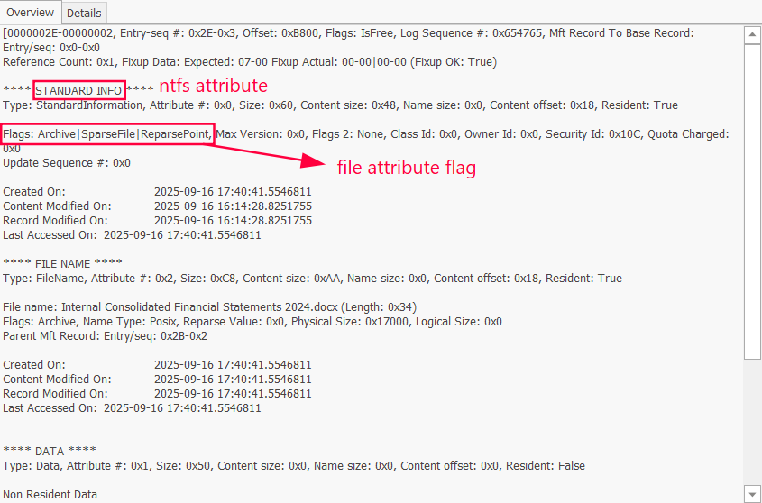

Using the Microsoft article above, I learnt that they are already sorted in ascending order by their hex values: `FILE_ATTRIBUTE_ARCHIVE (0x20)`, `FILE_ATTRIBUTE_SPARSE_FILE (0x200)`, and `FILE_ATTRIBUTE_REPARSE_POINT (0x400)`.

So the answer is: `FILE_ATTRIBUTE_ARCHIVE, FILE_ATTRIBUTE_SPARSE_FILE, FILE_ATTRIBUTE_REPARSE_POINT`.

##### Task 10 #####   

```text
At what offset in the $MFT file does the $REPARSE_POINT attribute of the report begin? (Answer as an 8-digit hexadecimal offset, prefixed with 0x)
```

From the same document in Task 9, I found that the `$REPARSE_POINT` attribute has the type code `0xC0`. I also found this document: [Reparse Tags](https://learn.microsoft.com/en-us/openspecs/windows_protocols/ms-fscc/c8e77b37-3909-4fe6-a4ea-2b9d423b1ee4). It states that each reparse point contains a tag identifying its owner. For data dedup, the tag is `IO_REPARSE_TAG_DEDUP`, and its value is `0x80000013`; in little-endian order, it should be `13 00 00 80`.

So we just need to search for this byte sequence inside MFT entry 46:

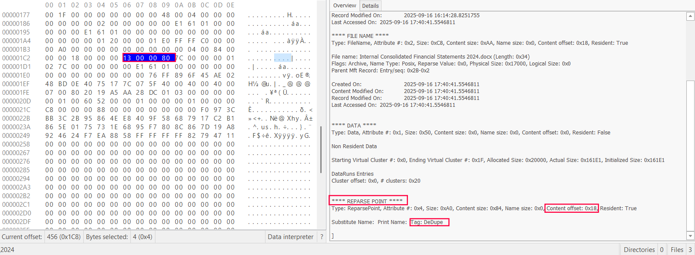

In this challenge it starts at offset `0x1C8`. The tool shows that the attribute is resident and that its content begins at offset `0x18` from the start of the attribute, which means `$REPARSE_POINT attribute start + 0x18 = IO_REPARSE_TAG_DEDUP`, so:

```math
\text{REPARSE\_POINT attribute start} = \text{IO\_REPARSE\_TAG\_DEDUP} - 0\text{x}18 = 0\text{x}1\text{C}8 - 0\text{x}18 = 0\text{x}1\text{B}0
```

As a cross-check, the bytes at `0x1B0` begin with `C0 00 00 00`, which corresponds to the `$REPARSE_POINT` attribute type code. But that's just the offset of the attribute in the entry itself, not in the `$MFT` file. Each MFT entry's size is `1024` = `0x00000400` bytes, and the DOCX entry number is `46` = `0x2E`, so the final offset is:

```math
0\text{x}00000400 * 0\text{x}2\text{E} + 0\text{x}1\text{B}0 = 0x0000\text{B}9\text{B}0
```

So the answer is: `0x0000B9B0`.

Sounds easy enough. But let's take a look at the real underlying mechanism and how the tool does it. Using the NTFS attribute document, I learnt that each `ATTRIBUTE_RECORD_HEADER` structure begins with `TypeCode` and `RecordLength`. The `TypeCode` identifies the attribute type, while `RecordLength` specifies the size of the current attribute record:

```c++
typedef struct _ATTRIBUTE_RECORD_HEADER {
  ATTRIBUTE_TYPE_CODE TypeCode;
  ULONG               RecordLength;
...
}
```

Moreover, from this document, [FILE_RECORD_SEGMENT_HEADER](https://learn.microsoft.com/en-us/windows/win32/devnotes/file-record-segment-header), I learnt that:

```c++
typedef struct _FILE_RECORD_SEGMENT_HEADER {
  MULTI_SECTOR_HEADER   MultiSectorHeader;
  ULONGLONG             Reserved1;
  USHORT                SequenceNumber;
  USHORT                Reserved2;
  USHORT                FirstAttributeOffset;
  ...
}
```

`FirstAttributeOffset` tells us where the first NTFS attribute begins relative to the start of the MFT record. Therefore, we can read the current attribute's `TypeCode`, then advance by its `RecordLength` to reach the next attribute.

For resident attributes, the same `ATTRIBUTE_RECORD_HEADER` also contains a `ValueOffset`, which points to the actual attribute content relative to the beginning of that attribute record:

```c++
struct {
      ULONG  ValueLength;
      USHORT ValueOffset;
      UCHAR  Reserved[2];
    } Resident;
```

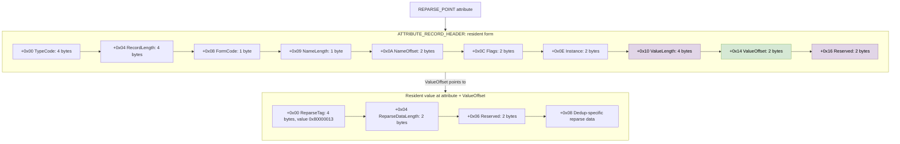
```mermaid
flowchart TB
    RP["REPARSE_POINT attribute"]

    subgraph ARH["ATTRIBUTE_RECORD_HEADER: resident form"]
        direction LR
        H00["+0x00 TypeCode: 4 bytes"]
        H04["+0x04 RecordLength: 4 bytes"]
        H08["+0x08 FormCode: 1 byte"]
        H09["+0x09 NameLength: 1 byte"]
        H0A["+0x0A NameOffset: 2 bytes"]
        H0C["+0x0C Flags: 2 bytes"]
        H0E["+0x0E Instance: 2 bytes"]
        H10["+0x10 ValueLength: 4 bytes"]
        H14["+0x14 ValueOffset: 2 bytes"]
        H16["+0x16 Reserved: 2 bytes"]
        H00 --> H04 --> H08 --> H09 --> H0A --> H0C --> H0E --> H10 --> H14 --> H16
    end

    subgraph VALUE["Resident value at attribute + ValueOffset"]
        direction LR
        V00["+0x00 ReparseTag: 4 bytes, value 0x80000013"]
        V04["+0x04 ReparseDataLength: 2 bytes"]
        V06["+0x06 Reserved: 2 bytes"]
        V08["+0x08 Dedup-specific reparse data"]
        V00 --> V04 --> V06 --> V08
    end

    RP --> ARH
    ARH -->|ValueOffset points to| VALUE

    classDef metadata fill:#e1d5e7,stroke:#9673a6,color:#000
    classDef pointer fill:#d5e8d4,stroke:#82b366,color:#000
    class H10,H16 metadata
    class H14 pointer
```

So, in order to locate `$REPARSE_POINT`, I can start from the first attribute of MFT entry 46, read each attribute's type code, and keep advancing by its `RecordLength` value until the type code `0xC0` is found. Therefore, the underlying mechanism can be reproduced with this script:

```py
import struct

mft_file = "$MFT"
mft_entry = 46
mft_record_size = 0x400

with open(mft_file, "rb") as f:
    record_offset = mft_entry * mft_record_size
    f.seek(record_offset)
    record = f.read(mft_record_size)

first_attr_offset = struct.unpack_from("<H", record, 0x14)[0]
offset = first_attr_offset

while offset < mft_record_size:
    type_code = struct.unpack_from("<I", record, offset)[0]

    if type_code == 0xFFFFFFFF:
        break

    record_length = struct.unpack_from("<I", record, offset + 0x04)[0]

    print(
        f"TypeCode=0x{type_code:02X}, "
        f"RelativeOffset=0x{offset:X}, "
        f"Length=0x{record_length:X}"
    )

    if type_code == 0xC0:
        absolute_offset = record_offset + offset
        form_code = record[offset + 0x08]

        if form_code == 0:
            value_offset = struct.unpack_from("<H", record, offset + 0x14)[0]
            reparse_tag = struct.unpack_from(
                "<I", record, offset + value_offset
            )[0]

            print(f"$REPARSE_POINT found at: 0x{absolute_offset:08X}")
            print(f"ValueOffset: 0x{value_offset:X}")
            print(f"ReparseTag: 0x{reparse_tag:08X}")
        break

    if record_length == 0:
        break

    offset += record_length
```

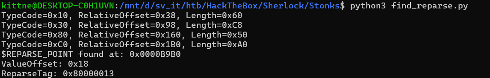

#### Data Deduplication structure & Rehydrate ####

##### Task 11 #####

```text
After the report was optimized by Data Deduplication, into how many chunks was its data divided?
```

From the information given earlier in this writeup, we know that the actual file data is stored as chunks, while `ChunkStore\{GUID}.ddp\Stream\` contains metadata describing how those chunks are mapped back to the logical file. There's only one `{6F89FF76-AE45-4802-BD0E-4075177C075F}.ddp` in this challenge, but in reality, there can be more than one. If that happens, we can check the GUID in the MFT entry after `IO_REPARSE_TAG_DEDUP`:

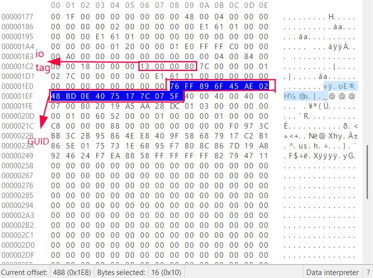

But how do we find where the chunk metadata of this specific file is stored inside `Stream\`?

I found this perfect paper from DFRWS EU 2017: [Forensic Analysis of Deduplicated File Systems](https://dfrws.org/sites/default/files/session-files/2017_EU_paper_forensic_analysis_of_deduplicated_file_systems.pdf). The paper performs a low-level analysis of Windows Server 2012 Data Deduplication and describes the relationship between the $REPARSE_POINT, the Stream container, and the Data container.

According to the paper, the `$REPARSE_POINT` of a dedup file contains several important values. Besides the original file size and the ChunkStore GUID, there is a 30-byte `stream header` at relative offset `0x78`. However, in this Windows Server 2012 R2 image, I can confirm that the byte sequence is 32 bytes long. This value identifies the stream belonging to that particular file inside the Stream container:

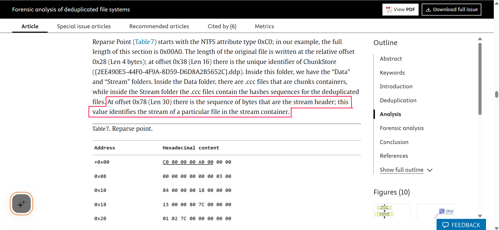

Since the attribute begins at `0x1B0`, the hex string we need to find should be located at `0x228`, and its value is `F0973CBB3C2B95864EE8409F58687917C2B1865E0175731E6895F7808C867D19`:

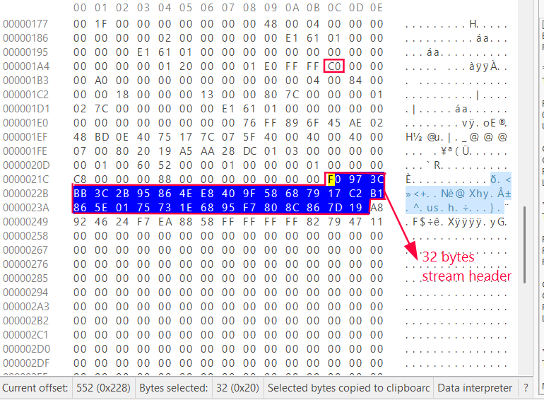

This gave me a better pivot than blindly searching through all `Smap` structures. Instead, we can extract the stream header directly from the report's `$REPARSE_POINT` and search for that exact byte sequence inside.

The paper also explains that a stream `.ccc` container contains several internal structures:

```text
Cthr    -> container/file header
Rrtl    -> redirection table
Ckhr    -> stream map entry
```

A `Ckhr` entry begins with the magic bytes `43 6B 68 72` and contains the stream header at relative offset `0x38`. Therefore, if the 32-byte value extracted from the `$REPARSE_POINT` is found inside a stream container, the beginning of its corresponding `Ckhr` entry should be `0x38` bytes before it. 

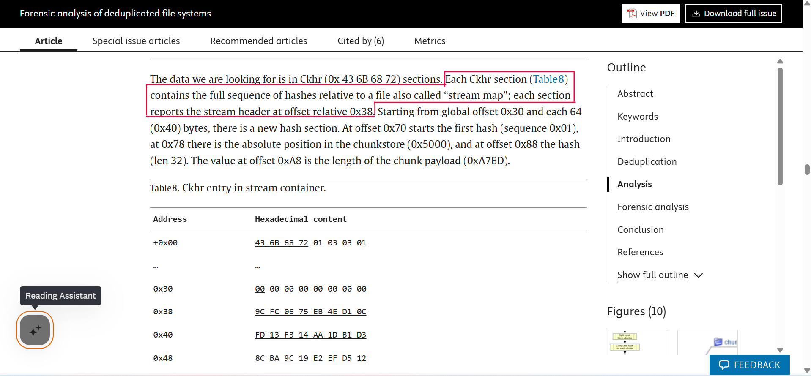

Therefore, I used a script to search the stream containers for the stream header extracted from the report's `$REPARSE_POINT`:

```py
import os

dir = r"./Dedup/ChunkStore/{6F89FF76-AE45-4802-BD0E-4075177C075F}.ddp/Stream"
header = bytes.fromhex("F0973CBB3C2B95864EE8409F58687917C2B1865E0175731E6895F7808C867D19")

for name in os.listdir(dir):
    if not name.endswith(".ccc"):
        continue

    path = os.path.join(dir, name)
    with open(path, "rb") as f:
        data = f.read()

    pos = data.find(header)
    if pos == -1:
        continue

    ckhr_offset = pos - 0x38

    print(f"[+] Stream header found in: {path}")
    print(f"[+] Stream header offset: 0x{pos:X}")
    print(f"[+] Expected Ckhr offset: 0x{ckhr_offset:X}")
```

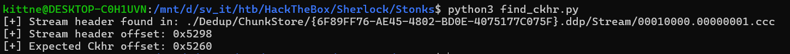

The script located the matching `Ckhr` entry in `Stream/00010000.00000001.ccc` at offset `0x5260`. This can be confirmed:

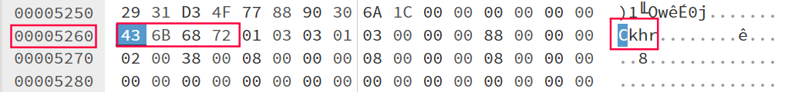

Now we can examine the structure of this `Ckhr` entry. From the article's information and my own observations, every `Ckhr` entry can be divided into 2 parts; let's call them the `control block` and `chunk block`. The `control block` always starts at `Ckhr offset + 0x30`, and a full block is always 64 bytes long. This means that every `chunk block` should appear at `Ckhr offset + 0x70`, `Ckhr offset + 0xB0`, etc., depending on the number of chunks into which the file was divided:

* The `control block` contains the 32-byte sequence, the `Smap` signature `53 6D 61 70`, and the byte sequence `01 04 04 01`:

```c++
struct control_block {
      uint8_t  zero[8];
      uint8_t  stream_header[32];
      uint8_t  unknown[16];
      uint8_t  smap_prefix[8];
    };
```

* As I said before, the number of `chunk blocks` may vary; one `Ckhr` entry can contain several `chunk blocks`. The article also states that `offset + 0x00` of a `chunk block` contains the `Ckhr` ordinal, which is cumulative across all `Ckhr` entries. At `offset + 0x08` is the offset in the Data `.ccc` container identified at offset `0x0C` (the article doesn't say this, but I confirmed that `offset + 0x0C` identifies the chunk container, so it should appear as a pair with `0x08` to locate the correct Data `Ckhr`). At `offset + 0x10` is the total cumulative payload length, at `offset + 0x18` is a 32-byte sequence (the DFRWS authors guessed that this is a SHA-256 hash, but it doesn't match in this case), and at `offset + 0x38` is the length of the chunk payload.

```c++
struct chunk_block {
    uint32_t ckhr_ordinal;
    uint32_t unknown;
    uint32_t data_ckhr_offset;
    uint32_t data_container;
    uint64_t cumulative_end;
    uint8_t  chunk_id[32];
    uint64_t chunk_length;
    };
```

Let's verify this:

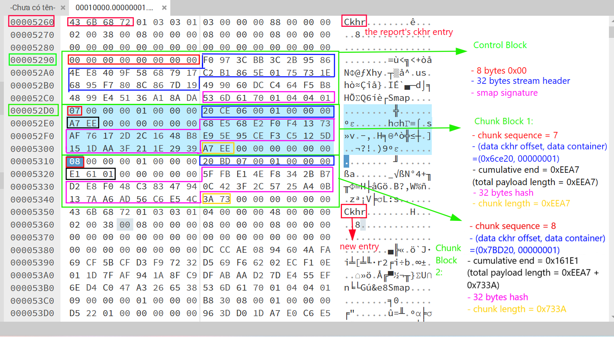

From the picture above, we obtained the following information about the report file:

```text
Chunk block 1:
- sequence_number       = 7
- data_ckhr_offset      = 0x06CE20
- data_container        = 00000001
- chunk_length          = 0xEEA7
- cumulative_end_offset = 0xEEA7
- chunk_id              = 68E568E2F0F41373AF76172D2C1648B8E95E95CEF3C5125D151DAA3F211E2939

Chunk block 2:
- sequence_number       = 8
- data_ckhr_offset      = 0x07BD20
- data_container        = 00000001
- chunk_length          = 0x733A
- cumulative_end_offset = 0x161E1
- chunk_id              = 5FFBE14EF8342BB7D2E8F048C38347940C423F2C5725A40B137AA6AD56C6E54C
```

So the answer is: `2`.

##### Task 12 #####

```text
What is the data length in bytes of the first deduplicated chunk belonging to the report file under investigation?
```

In the last question, we identified that the length of the report's first chunk is `0xEEA7`, which is `61095` in decimal.

So the answer is: `61095`.

##### Task 13 #####

```text
After recovering the file, provide the SHA-256 hash of the recovered financial report.
```

Now we need to recover the file to answer this question. This process is called `rehydration`, and in Windows Server 2012, `Dedup.sys` is the binary that performs it.

Since we know the `Ckhr` offset and the lengths of the 2 chunks, this should be easy. Since the metadata in the stream map identifies the Data container as `00000001`, we can jump to offset `0x06CE20` of `{6F89FF76-AE45-4802-BD0E-4075177C075F}.ddp/Data/00000001.00000001.ccc` to find the `Ckhr` signature as expected:

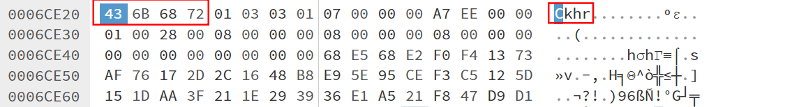

Using the same DFRWS research paper and my own observations, we can examine the `Ckhr` structure of `Data\.ccc`:

* Let's call the first byte of the `Ckhr` signature offset `0x00`. At offset `0x08` is the same ordinal number as the stream entry number. At offset `0x0C` is the chunk's payload size, while at `0x28` is the 32-byte `chunk_id` sequence that maps to the stream map. Notably, the article states that the payload starts at offset `0x5C`, but in my observation, the real payload actually starts at `0x58`, with the magic header of the deduplicated file:

```c++
struct data_ckhr {
    char     magic[4];
    uint8_t  unknown[4];
    uint32_t ckhr_ordinal;
    uint32_t chunk_size;
    uint8_t  unknown[24];
    uint8_t  chunk_id[32];
    uint8_t  preamble[16];
    uint8_t  payload[];
    };
```

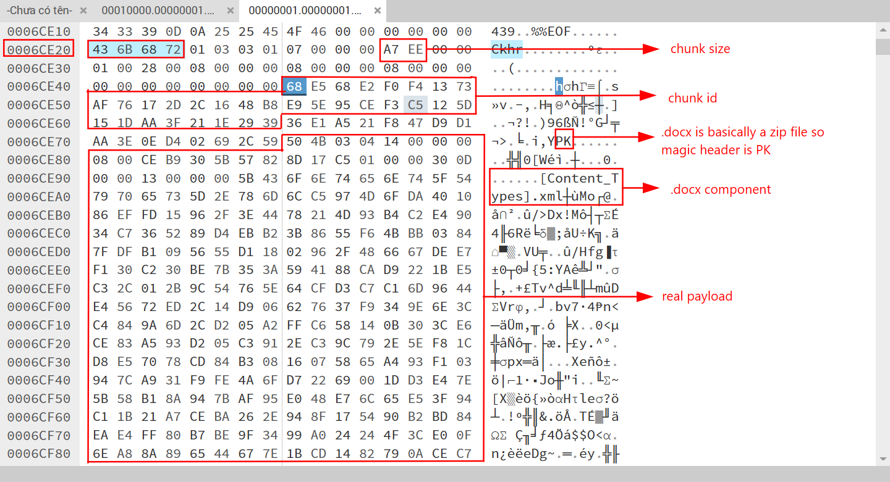

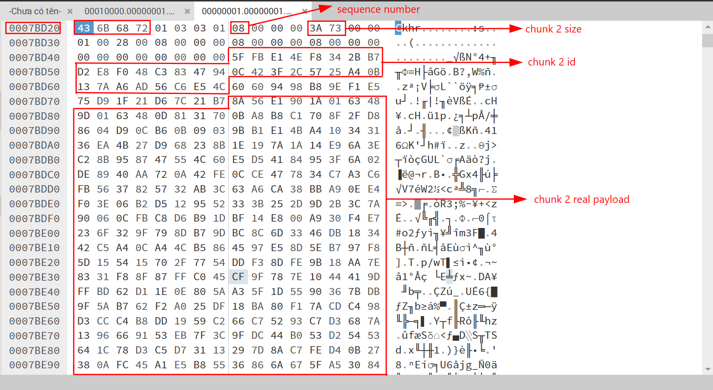

An important detail mentioned in the DFRWS paper is that optimized chunks may be stored in compressed form. In that case, the stored chunk size in the `Data` container would differ from the chunk's logical size, and the chunk would need to be decompressed before the original file could be reconstructed.

For this report, however, the stored payload lengths of both chunks in `Data` match the logical chunk lengths derived from the metadata in `Stream`:

```math
\text{Chunk 1: }
\text{Stored size} = \text{Logical size} = 0\text{x}\text{E}\text{E}\text{A}7.
```

```math
\text{Chunk 2: }
\text{Logical size} = 0x161\text{E}1 - 0\text{x}\text{E}\text{E}\text{A}7 = 0x733\text{A} = \text{Stored size}.
```

So I extracted `0xEEA7` bytes starting from `0x06CE20 + 0x58 = 0x06CE78` and `0x733A` bytes from `0x07BD20 + 0x58 = 0x07BD78`, then concatenated them to get the report. The file's total size should be `0x161E1` (90,593) bytes:

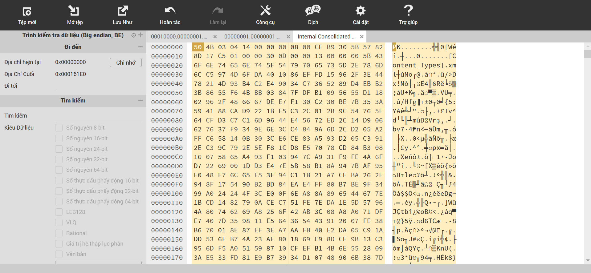

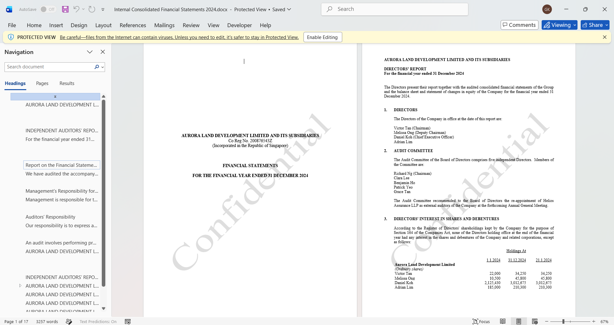

I used `sha256sum` to get the SHA-256 hash of this file:

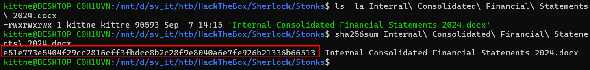

So the answer is: `e51e773e5404f29cc2816cff3fbdcc8b2c28f9e8040a6e7fe926b21336b66513`.

##### Task 14 #####

```text
The person who drafted this report must also be held legally accountable. What is their Full name?
```

To find the person who drafted the report, I checked its metadata using `exiftool`:

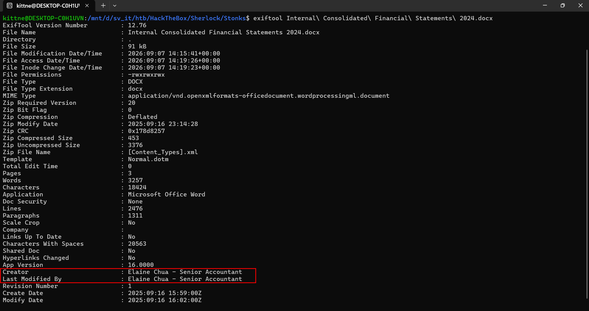

Both the creator and the last person to modify it were `Elaine Chua`.

So the answer is: `Elaine Chua`.

##### Task 15 #####

```text
How much was the profit for the year overstated in the audited report compared to the actual one?
```

To answer this question, we must rehydrate the `Audited Consolidated Financial Statements 2024.docx` at MFT entry `44`:

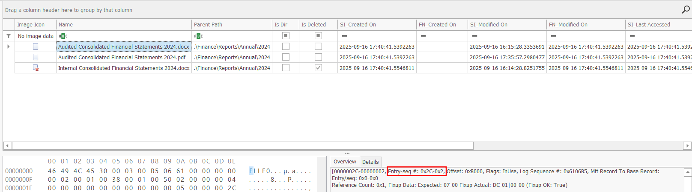

The process is the same as the one we used to rehydrate the `Internal` report, so the same procedure can be applied as follows:

- Using MFTExplorer to find the `$REPARSE_POINT` attribute at offset `0x1A8`, so that the stream header is located at `0x1A8 + 0x78 = 0x220`: `19E49892840D301C26D1CEBEFC6CB6FFDBAF4F0FA043B577ACF38B990BBDA146`:

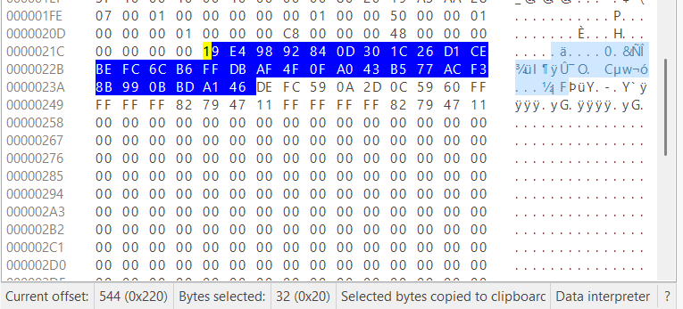

- Using the script in Task 11 to find the Stream `Ckhr` entry:

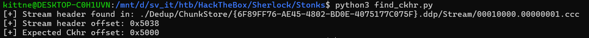

- The `Ckhr` entry offset of this file is `0x5000`, so we can jump to offset `0x5000` of `Stream/00010000.00000001.ccc` and find metadata about the Data `Ckhr`:

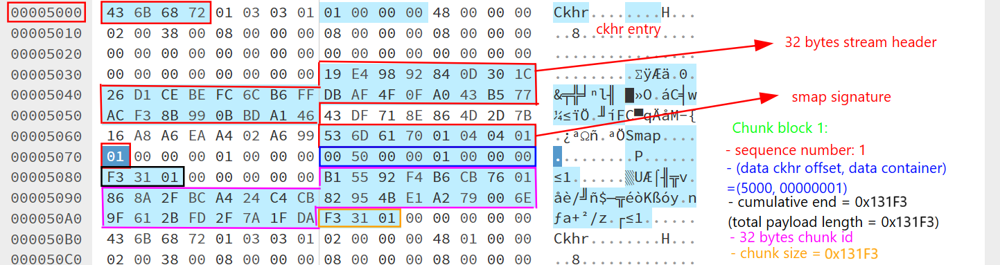

```text
Chunk block 0:
- sequence_number       = 1
- data_ckhr_offset      = 0x5000
- data_container        = 00000001
- chunk_length          = 0x131F3
- cumulative_end_offset = 0x131F3
- chunk_id              = B15592F4B6CB7601868A2FBCA424C4CB82954BE1A279006E9F612BFD2F7A1FDA
```

- The Data `Ckhr` entry has the same offset, `0x5000`, as the Stream entry, so we can jump to offset `0x5000` of `Data/00000001.00000001.ccc` and extract `0x131F3` bytes starting from offset `0x5000 + 0x58 = 0x5058`:

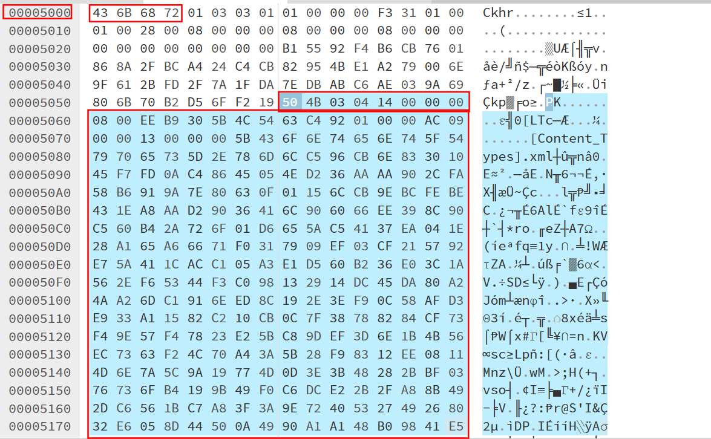

- The audited report's SHA-256 hash should be `b2db23c3b4c09467ed465cc6ffe7ba841412d03a3ad2444310f9e730c0eb6702`. After recovering the audited file, I opened it and found that the profit was `2,672,196`, while in the internal report, it was `–1,647,555` (yes, it's really a negative number):

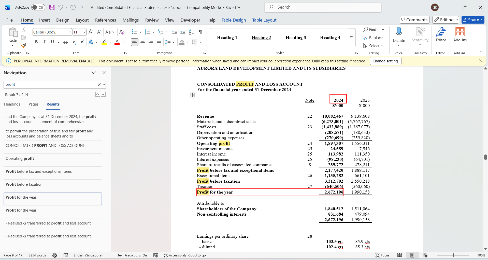

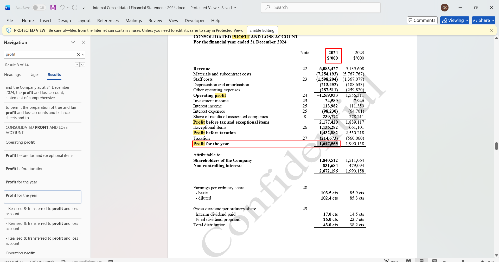

The difference between the audited and the internal report was:

```math
2,672,196 - (–1,647,555) = 4,319,751.
```

So the answer is: `4319751`.

## 3. Questions and Answers ##

<table style="width: 100%; border-collapse: collapse; color: #ffffff; background-color: #1e1e1e; font-family: sans-serif;">
  <thead>
    <tr style="background-color: #333333;">
      <th style="border: 1px solid #444444; padding: 10px; text-align: center; width: 5%;">Task</th>
      <th style="border: 1px solid #444444; padding: 10px; text-align: center; width: 55%;">Question</th>
      <th style="border: 1px solid #444444; padding: 10px; text-align: center; width: 40%;">Answer</th>
    </tr>
  </thead>
  <tbody>
    <tr>
      <td style="border: 1px solid #444444; padding: 10px; text-align: center;">1</td>
      <td style="border: 1px solid #444444; padding: 10px; text-align: left;">When was the Windows Data Deduplication feature first installed on the system?</td>
      <td style="border: 1px solid #444444; padding: 10px; text-align: center;">2025-09-18 09:56:40</td>
    </tr>
    <tr>
      <td style="border: 1px solid #444444; padding: 10px; text-align: center;">2</td>
      <td style="border: 1px solid #444444; padding: 10px; text-align: left;">How many bytes of disk space were saved after the first optimization job was completed by Data Deduplication?</td>
      <td style="border: 1px solid #444444; padding: 10px; text-align: center;">6805707</td>
    </tr>
    <tr>
      <td style="border: 1px solid #444444; padding: 10px; text-align: center;">3</td>
      <td style="border: 1px solid #444444; padding: 10px; text-align: left;">When was Data Deduplication most recently re-enabled on volume D:?</td>
      <td style="border: 1px solid #444444; padding: 10px; text-align: center;">2025-09-20 03:34:35</td>
    </tr>
    <tr>
      <td style="border: 1px solid #444444; padding: 10px; text-align: center;">4</td>
      <td style="border: 1px solid #444444; padding: 10px; text-align: left;">List all file extensions that are not optimized by Data Deduplication in alphabetical order.</td>
      <td style="border: 1px solid #444444; padding: 10px; text-align: center;">avi, bak, edb, iso, jrs, mp4, tif</td>
    </tr>
    <tr>
      <td style="border: 1px solid #444444; padding: 10px; text-align: center;">5</td>
      <td style="border: 1px solid #444444; padding: 10px; text-align: left;">How many files have been optimized by Data Deduplication?</td>
      <td style="border: 1px solid #444444; padding: 10px; text-align: center;">168</td>
    </tr>
    <tr>
      <td style="border: 1px solid #444444; padding: 10px; text-align: center;">6</td>
      <td style="border: 1px solid #444444; padding: 10px; text-align: left;">When is the next Throughput Optimisation job scheduled to run?</td>
      <td style="border: 1px solid #444444; padding: 10px; text-align: center;">2025-09-25 06:50:00</td>
    </tr>
    <tr>
      <td style="border: 1px solid #444444; padding: 10px; text-align: center;">7</td>
      <td style="border: 1px solid #444444; padding: 10px; text-align: left;">What is the name of the financial report that was recently deleted in an attempt to cover up criminal activity?</td>
      <td style="border: 1px solid #444444; padding: 10px; text-align: center;">Internal Consolidated Financial Statements 2024.docx</td>
    </tr>
    <tr>
      <td style="border: 1px solid #444444; padding: 10px; text-align: center;">8</td>
      <td style="border: 1px solid #444444; padding: 10px; text-align: left;">What is the MFT entry number of that report file?</td>
      <td style="border: 1px solid #444444; padding: 10px; text-align: center;">46</td>
    </tr>
    <tr>
      <td style="border: 1px solid #444444; padding: 10px; text-align: center;">9</td>
      <td style="border: 1px solid #444444; padding: 10px; text-align: left;">List all the FILE_ATTRIBUTE flags that are set on the report file. Submit answer in ascending order based on the hex value of each flag.</td>
      <td style="border: 1px solid #444444; padding: 10px; text-align: center;">FILE_ATTRIBUTE_ARCHIVE, FILE_ATTRIBUTE_SPARSE_FILE, FILE_ATTRIBUTE_REPARSE_POINT</td>
    </tr>
    <tr>
      <td style="border: 1px solid #444444; padding: 10px; text-align: center;">10</td>
      <td style="border: 1px solid #444444; padding: 10px; text-align: left;">At what offset in the $MFT file does the $REPARSE_POINT attribute of the report begin? (Answer as an 8-digit hexadecimal offset, prefixed with 0x)</td>
      <td style="border: 1px solid #444444; padding: 10px; text-align: center;">0x0000b9b0</td>
    </tr>
    <tr>
      <td style="border: 1px solid #444444; padding: 10px; text-align: center;">11</td>
      <td style="border: 1px solid #444444; padding: 10px; text-align: left;">After the report was optimized by Data Deduplication, into how many chunks was its data divided?</td>
      <td style="border: 1px solid #444444; padding: 10px; text-align: center;">2</td>
    </tr>
    <tr>
      <td style="border: 1px solid #444444; padding: 10px; text-align: center;">12</td>
      <td style="border: 1px solid #444444; padding: 10px; text-align: left;">What is the data length in bytes of the first deduplicated chunk belonging to the report file under investigation?</td>
      <td style="border: 1px solid #444444; padding: 10px; text-align: center;">61095</td>
    </tr>
    <tr>
      <td style="border: 1px solid #444444; padding: 10px; text-align: center;">13</td>
      <td style="border: 1px solid #444444; padding: 10px; text-align: left;">After recovering the file, provide the SHA-256 hash of the recovered financial report.</td>
      <td style="border: 1px solid #444444; padding: 10px; text-align: center;">e51e773e5404f29cc2816cff3fbdcc8b2c28f9e8040a6e7fe926b21336b66513</td>
    </tr>
    <tr>
      <td style="border: 1px solid #444444; padding: 10px; text-align: center;">14</td>
      <td style="border: 1px solid #444444; padding: 10px; text-align: left;">The person who drafted this report must also be held legally accountable. What is their Full name?</td>
      <td style="border: 1px solid #444444; padding: 10px; text-align: center;">Elaine Chua</td>
    </tr>
    <tr>
      <td style="border: 1px solid #444444; padding: 10px; text-align: center;">15</td>
      <td style="border: 1px solid #444444; padding: 10px; text-align: left;">How much was the profit for the year overstated in the audited report compared to the actual one?</td>
      <td style="border: 1px solid #444444; padding: 10px; text-align: center;">4319751</td>
    </tr>
  </tbody>
</table>
