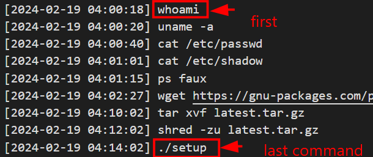

# WRITE_UP #

## WRONG SPOOKY SEASON ##

## 1. Analysis ##
* **Given:** a file named `bash_history.txt` and `sshd.log`
* **Description:**
* **Hints:**   
    * No hints are given 

## 2. Investigation ##
### IS THAT UNUSUAL ###

This chal requires to connect through a ssh, in my case my big brother (respect) opened an instance for me:
```bash
nc 154.57.164.81 32071
+---------------------+---------------------------------------------------------------------------------------------------------------------+
|        Title        |                                                     Description                                                     |
+---------------------+---------------------------------------------------------------------------------------------------------------------+
| An unusual sighting |                        As the preparations come to an end, and The Fray draws near each day,                        |
|                     |             our newly established team has started work on refactoring the new CMS application for the competition. |
|                     |                  However, after some time we noticed that a lot of our work mysteriously has been disappearing!     |
|                     |                     We managed to extract the SSH Logs and the Bash History from our dev server in question.        |
|                     |               The faction that manages to uncover the perpetrator will have a massive bonus come the competition!   |
|                     |                                                                                                                     |
|                     |                                            Note: Operating Hours of Korp: 0900 - 1900                               |
+---------------------+---------------------------------------------------------------------------------------------------------------------+


Note 2: All timestamps are in the format they appear in the logs
```
* **The first question:** `What is the IP Address and Port of the SSH Server (IP:PORT)`
  
Using the `sshd.log` file, in the very first line, we can clearly see this line: `Server listening on 0.0.0.0 port 2221`.

Moreover, we could see a pattern that's try to establish a connection to this server:
`Connection from <src.ip> port <src.port> on <dst.ip> port <dst.port> rdomain ""` such as these ones:


So the answer is: `100.107.36.130:2221`

* **The second question:** `What time is the first successful Login`

Still using the `sshd.log` file, after efforts bruteforcing the password for `root`, we could see that the first time that the password accepted is:
`[2024-02-13 11:29:50] Accepted password for root from 100.81.51.199 port 63172 ssh2`

So the answer is: `2024-02-13 11:29:50`

* **The third question:** `What is the time of the unusual Login`

Because the `log` file only give me the time attackers bruteforce and connect to the server, I tried something new with the `bash_history.txt`.

Scrolling through it little, besides some python scripts were ran in understandable time, I noticed this:


Who the hell would run `whoami` and `cat /etc/passwd` at `04:00:20` while the operating hours are from `0900 - 1900` (mentioned in the note). That's look so suspicious, I cross-refered to the `log` file to find the time the attacker logged in around that time, then I was locked in my answer: `2024-02-19 04:00:14`

So the answer is: `2024-02-19 04:00:14`

* **The fourth question:** `What is the Fingerprint of the attacker's public key`

So we know the attacker got the control of the victim's machine at `2024-02-19 04:00:14`, using the `.log` file, we could easily locate the `SHA256`:


So the answer is: `OPkBSs6okUKraq8pYo4XwwBg55QSo210F09FCe1-yj4`

* **The fifth and sixth question:** `What is the first command the attacker executed after logging in` and `What is the final command the attacker executed before logging out`

After identifying the exact time the attacker controled the machine, these question kinda easy, so here is the answers:



So the answer is: `whoami` and `./setup`

## 3. Solution ##
1. **Result:** The flag is `HTB{4n_unusual_s1ght1ng_1n_SSH_l0gs!}`


