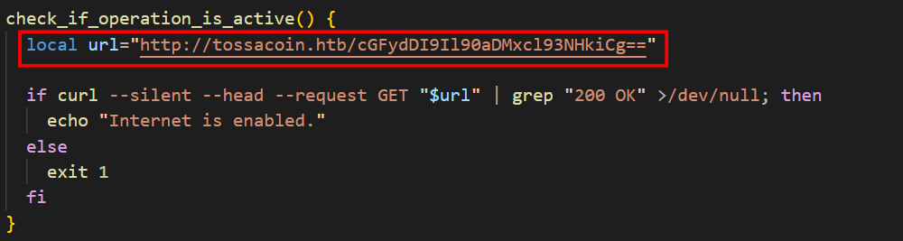
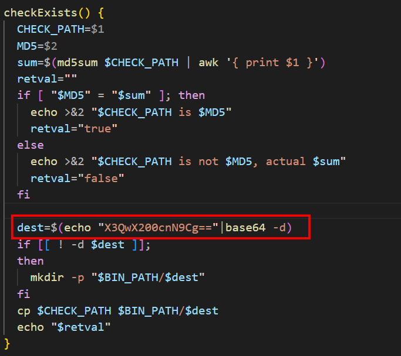
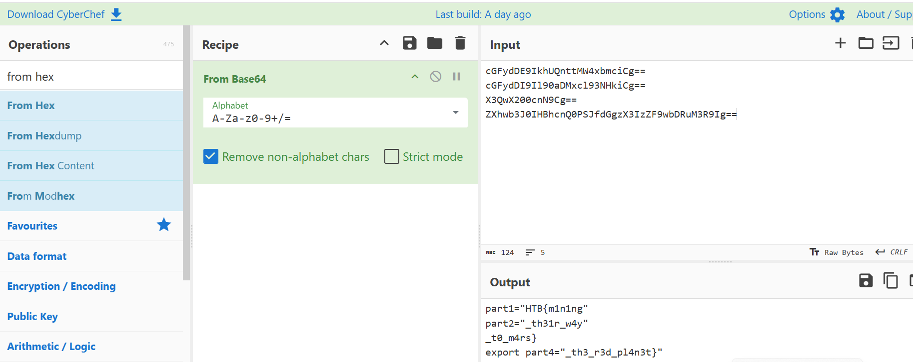

# WRITE_UP #

## RED MINERS ##

## 1. Analysis ##
* **Given:** a file named `miner_installer.sh`
* **Description:**
* **Hints:**   
    * No hints are given 

## 2. Investigation ##
### MINING TIME ###

Received the `.sh` file, I use `VSCode` to open it:

There's again a function called `checkTarget`:

```sh
  EXPECTED_USERNAME="root7654"
  EXPECTED_HOSTNAME_PREFIX="UNZ-"

  CURRENT_USERNAME=$(whoami)
  CURRENT_HOSTNAME=$(hostname)

  if [[ "$CURRENT_USERNAME" != "$EXPECTED_USERNAME" ]]; then
      exit 1
  fi

  if [[ ! "$CURRENT_HOSTNAME" == "$EXPECTED_HOSTNAME_PREFIX"* ]]; then
      exit 1
  fi
```

First, the program uses `whoami` and `hostname` to check those two variables, if those were different from `root7654` or do not starts with `UNZ-`, the program automatically exits.

The next function caught my eyes was the `cleanEnv` 'cause it uses linux command to interact with important files such as `/root/.ssh/authorized_keys`, ...:


Scrolling through little more, the function tried to kill a lots processes using `pkill` and `ps aux` command.
you can read more abt it here: `https://www.linuxhowtos.org/Tips%20and%20Tricks/kill_processes.htm?print=154`.

Moreover, there's some killing command look likes this:
```sh
ps auxf | grep -v grep | grep "mine.moneropool. whecom" | awk '{print $2}' | xargs -I % kill -9 %
  ps auxf | grep -v grep | grep "pool.t00ls.ru" | awk '{print $2}' | xargs -I % kill -9 %
  ps auxf | grep -v grep | grep "xmr.crypto-pool.fr:8080" | awk '{print $2}' | xargs -I % kill -9 %
  ps auxf | grep -v grep | grep "xmr.crypto-pool.fr:3333" | awk '{print $2}' | xargs -I % kill -9 %
  ps auxf | grep -v grep | grep "/tmp/a7b104c270" | awk '{print $2}' | xargs -I % kill -9 %
  ps auxf | grep -v grep | grep "xmr.crypto-pool.fr:6666" | awk '{print $2}' | xargs -I % kill -9 %
  ps auxf | grep -v grep | grep "xmr.crypto-pool.fr:7777" | awk '{print $2}' | xargs -I % kill -9 %
  ps auxf | grep -v grep | grep "xmr.crypto-pool.fr:443" | awk '{print $2}' | xargs -I % kill -9 %
  ps auxf | grep -v grep | grep "stratum.f2pool.com:8888" | awk '{print $2}' | xargs -I % kill -9 %
  ps auxf | grep -v grep | grep "xmrpool.eu" | awk '{print $2}' | xargs -I % kill -9 %
```
With some researches, I acknowledged that these are crypto mining pool, we don't need to know abt it to solve this chal so I'm gonna let it sink here, but from this, we know that this is a crypto mining program.

Scrolling through a little more, I saw this function:


The func has a url contains a base64 string `cGFydDI9Il90aDMxcl93NHkiCg==`, and try to check connection by sending a silent `HEAD` request to that `url` and check for the `200 OK` in the response header.

Next one is this function called `checkExists:`


This function checks the `MD5 hash` to confirm the `path` is correct, then it makes a directory in the `BIN_PATH/$dest` and then copy `$CHECK_PATH` to the `$BIN_PATH/$dest`. Btw we found another base64 string: `X3QwX200cnN9Cg==`.

Then, scrolling down a bit we find another b64 string which writen to the `.bashrc` file:
`echo "ZXhwb3J0IHBhcnQ0PSJfdGgzX3IzZF9wbDRuM3R9Ig==" | base64 -d >> /home/$USER/.bashrc`

And in the very last line of the code we found the last b64 string which is `cGFydDE9IkhUQnttMW4xbmciCg==`:


Now let CyberChef do its work:


## 3. Solution ##
1. **Result:** The flag is `HTB{m1n1ng_th31r_w4y_t0_m4rs_th3_r3d_pl4n3t}`


