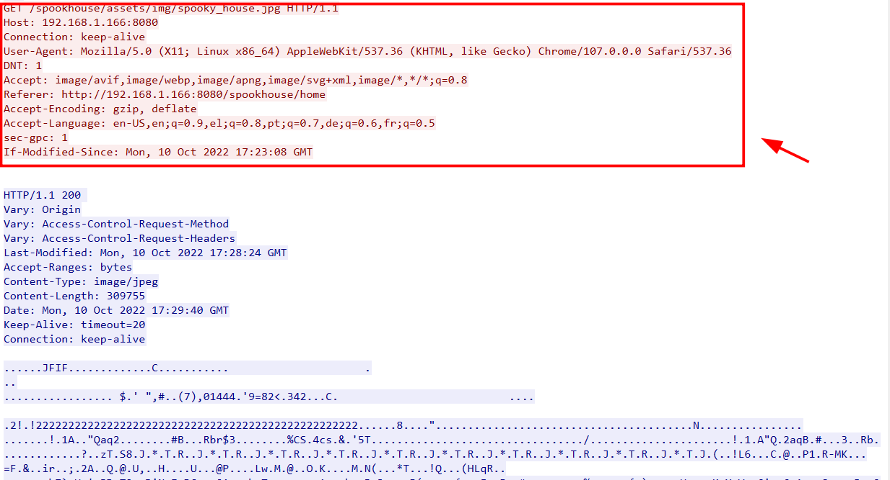
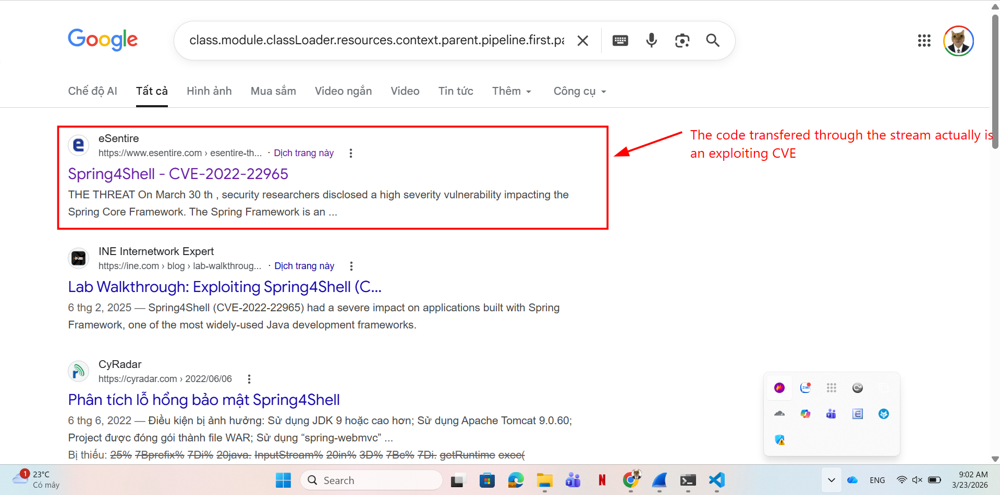
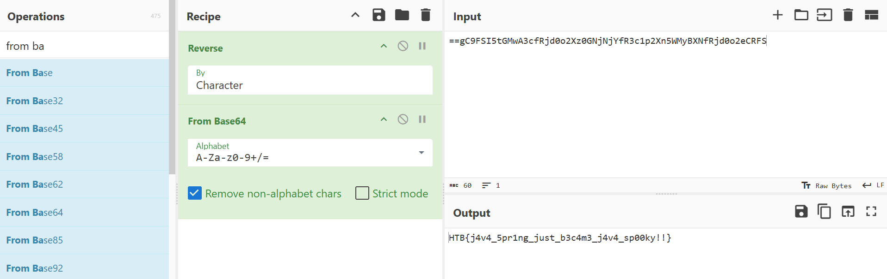

# WRITE_UP #

## WRONG SPOOKY SEASON ##

## 1. Analysis ##
* **Given:** a pcap file named `capture.pcap`
* **Description:**

* **Hints:**   
    * No hints are given 

## 2. Investigation ##
### SPRING4SHELL CVE ###
At first, when opened the pcap file, we can see a lots `.jpg` file transfered through some streams such as this one:

Scrolling a little more, in the `TCP stream 7`, we captured this one `HTTP POST request` with some java code look quite sus:

.

After some research, I knew that this is actually an exploiting `CVE-2022-22965 SPRING4SHELL`:

So basically, by injecting values into `class.module.classLoader.resources.context.parent.pipeline.first.pattern`, the attacker reconfigures the logging mechanism to write a malicious `.jsp` in `ROOT` directory. After received the file, the attacker can execute commands by sending requests to that JSP file.

The HTTP access logs for exploitation attempts will look like this:
`GET /example/tomcatwar.jsp?pwd=j&cmd=whoami HTTP/1.1`

Next, next streams contain `GET` requests that match the pattern:

The attacker command had access to `whoami`, `id`, `install socat`, then used `socat` to connect a `reverse shell` to a TCP address: `IP: 192.168.1.180` at `port: 1337` 

In the next stream, we can clearly see the log file contains shell content mentioned before, that's where we can see the flag also:

## 3. Solution ##
1. **Result:** The flag is `HTB{j4v4_5pr1ng_just_b3c4m3_j4v4_sp00ky!!}`

